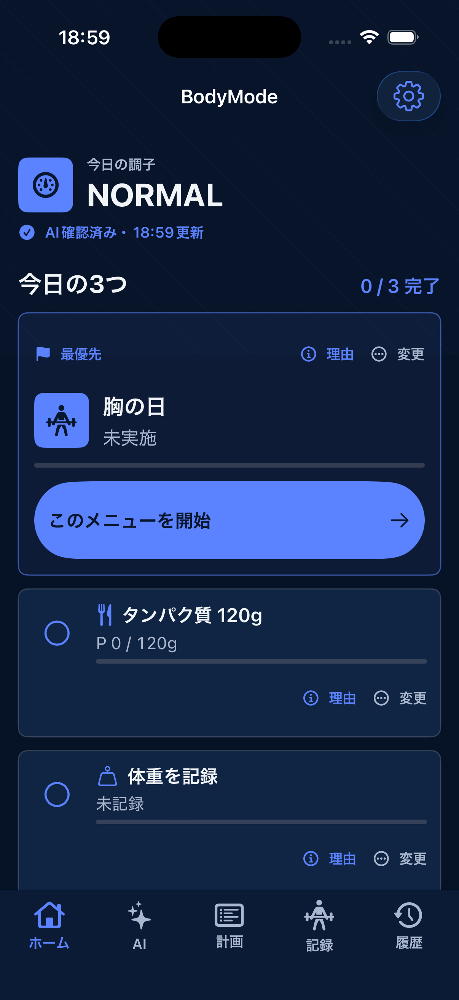
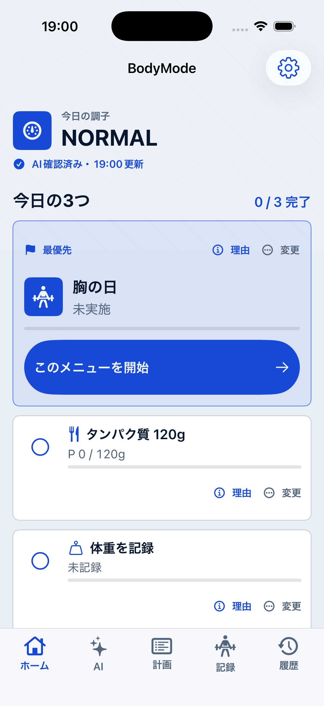

# BodyMode Adult UX Blueprint

Updated: 2026-08-14

## Recommendation

BodyModeの主画面は「データを見る場所」ではなく、「次にする1件を迷わず始める場所」とする。高度な記録、分析、AI、設定は維持しつつ、ホームでは今日の調子、今日の3件、最優先アクション、クイック記録だけを先に見せる。

最大の理由は、機能不足ではなく、同じ重要度に見える情報が多いために次の操作が見つかりにくくなっていたことにある。

## Users And Contexts

| Profile | Primary job | Context | UX requirement |
| --- | --- | --- | --- |
| 初回・初心者 | 今日何をすればよいか知る | 朝、短時間 | 推奨を先に提示し、判断を3件以内にする |
| 定期利用者 | いつもの記録と運動を早く終える | 食事中、ジム、移動中 | 前回値、クイック記録、1タップ開始 |
| 熟練者 | 計画・履歴・PFC・分析を調整する | 落ち着いて確認 | 詳細モード、検索、履歴、編集を維持 |
| 中断後の利用者 | 処理状況を確認して再開する | AI通信中、Watch連携中 | 更新元、更新時刻、処理継続、再試行を表示 |
| 健康配慮が必要な利用者 | 安全に傾向を把握する | 疲労時、データ不足時 | 診断と誤認させず、根拠と不足情報を確認可能にする |

Applied profiles: general use, repeat-use expert, high-risk health/privacy, real-time sync, AI-assisted.

## Complexity And Risk

| Function | Exposure | Protection | Placement and behavior |
| --- | --- | --- | --- |
| 今日の最優先アクション | High | Low | ホーム上部に大きく表示し即時実行 |
| 食事・体重・写真記録 | High | Low | ホームと各詳細画面の両方から到達 |
| AI提案の理由 | High | Medium | 各提案に「理由」を常時表示 |
| 今日の提案変更 | Medium | Medium | 「変更」から実行し、変更理由を履歴へ保存 |
| 目標値の自動調整 | Medium | High | 候補だけ提示し、承認後に反映 |
| データ共有・AI設定 | Low | High | 設定画面で範囲、状態、停止を明示 |
| 詳細分析・学習評価 | Low | Low | 「詳しく見る」内へ段階的に開示 |

## Information Architecture

### Home

1. 今日の調子
2. 提案の更新元・更新時刻
3. 今日の3つと達成数
4. 最優先アクションと実行ボタン
5. 残りのアクション
6. クイック記録
7. コーチの判断
8. 今日の振り返りと変更履歴
9. 詳細モード

### Root navigation

- ホーム: 今日の判断と実行
- AI: コーチ相談、食事写真解析、体型写真解析
- 計画: メニュー作成、AI計画、種目管理
- 記録: 身体、食事、写真、コンディションの直接入力
- 履歴: 日付横断の確認、比較、完了トレーニング詳細

## Critical Flows

### First value

初回設定を完了する → ホームに今日の3つが即時表示される → 最優先アクションを開始する。AI通信は初期表示を止めない。

### Daily shortest path

ホームを開く → 最優先アクションを見る → 大きなボタンを押す → 既存の記録またはトレーニング画面で完了する → ホームの進捗へ反映する。

### Expert path

ホームの「詳しく見る」または下部タブから、計画、詳細PFC、履歴、AI記憶、HealthKit状態へ直接移動する。

### AI delay or failure

端末内ルールの提案を表示する → 「AI確認中・提案は利用可能」と表示する → 画面を閉じても処理を継続する → 成功時のみ更新時刻と理由を更新する。失敗時も端末内提案と入力内容を保持する。

### Correction and undo

各アクションの「変更」から代替を選ぶ → ユーザー変更として履歴を残す。重要な目標変更は承認・見送りを明示し、自動確定しない。

## Home Screen Contract

- Profile: 初心者、定期利用者、疲労時、AI通信不安定時
- Goal: 5秒以内に今日の状態と次の1件を説明できる
- Primary action: 最優先DailyActionを開始または記録する
- Secondary actions: 理由を見る、行動を変更する、食事・体重・写真を記録する
- Visible information: readiness、source、freshness、3件、progress、primary CTA
- Hidden details: グラフ、学習率、全履歴、詳細PFC、センサー詳細
- Entry points: 起動、ホームタブ、通知
- Exit points: トレーニング、記録、コンディション、AI判断詳細
- Trust evidence: AI/端末内の処理主体、更新時刻、判断理由、不足データ
- Manual fallback: AIなしでも端末内提案と全手動記録を利用可能
- Human confirmation: 目標値と計画を変える提案は承認後に反映
- Success metric: 最優先CTA到達時間、DailyAction着手率、1件以上完了日率

## Interaction States

| State | User-facing behavior | Recovery |
| --- | --- | --- |
| Loading | 「今日の3つを準備しています」 | 端末内ルールで短時間に確定 |
| Local ready | 「端末内で作成・時刻更新」 | そのまま全機能を利用可能 |
| AI checking | 「AI確認中・提案は利用可能」 | 画面を閉じても継続 |
| AI checked | 「AI確認済み・時刻更新」 | 理由と変更履歴を確認可能 |
| AI failed | 端末内提案を保持し、再試行を提示 | 入力と現在の提案を失わない |
| Partial data | 調子は表示し、不足情報を理由画面に示す | 手入力またはHealthKit再取得 |
| All complete | 完了状態と夜の振り返りを表示 | 詳細履歴へ移動可能 |

## Accessibility

- 主要操作は44pt以上、最優先CTAは54pt以上とする。
- Dynamic Typeでタイトルとボタン文言を折り返し、固定高さで切らない。
- 色だけで状態を区別せず、アイコンと「確認中」「完了」などの文字を併用する。
- 「理由」「変更」を長押しや説明のないジェスチャーだけに置かない。
- VoiceOverでは処理主体、更新時刻、現在値、目標値、完了状態を読めるようにする。
- Reduce Motionでも状態遷移と完了が理解できるようにする。

## Analytics Events

必要最小限として以下を測定する。健康数値や自由入力本文はイベントへ含めない。

- `home_primary_action_started`
- `daily_action_reason_opened`
- `daily_action_replaced`
- `quick_record_opened` with category only
- `recommendation_source_shown` with local/ai/mixed only
- `daily_action_completed`

## Acceptance Tests

1. 初回利用者がホーム表示後5秒以内に「今日の調子」「今日の3つ」「最初に押すボタン」を説明できる。
2. 最優先アクションの実行ボタンが初期表示内にあり、スクロールせず操作できる。
3. 各アクションから理由と変更へ直接到達できる。
4. AI無効時に警告色や故障表現を出さず、端末内提案を利用できる。
5. AI確認中も最優先アクションを開始でき、画面移動で処理が失われない。
6. AI確認済みの場合、処理主体と更新時刻を確認できる。
7. 目標調整は承認前に現在値、候補値、理由を確認でき、見送り可能である。
8. Dynamic Typeを拡大しても主要ボタン、数値、タブが欠けない。
9. VoiceOverだけで最優先アクションの開始と理由表示を完了できる。
10. AI失敗後も手動記録、トレーニング、端末内提案を利用できる。

## Implementation Scope

Implemented in this iteration:

- Home hierarchy centered on the primary DailyAction
- First-viewport primary CTA
- Visible reason and replace controls
- Recommendation source and freshness
- Non-alarming local/AI states and background-processing copy
- Coach detail moved below action and quick-record controls
- Coarse, on-device analytics for primary actions, reasons, replacements, quick records, and recommendation source

## Visual Verification

Dark mode:

Light mode:

Next safe increments:

- Apply the same source/freshness/error contract to AI chat, meal analysis, and physique analysis
- Add previous-value and recent-item shortcuts to all repeated numeric entry flows
- Simplify Record and History screens using the same one-purpose hierarchy
- Validate Dynamic Type, VoiceOver, light/dark themes, and interruption recovery on physical devices
