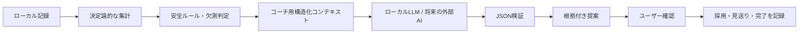
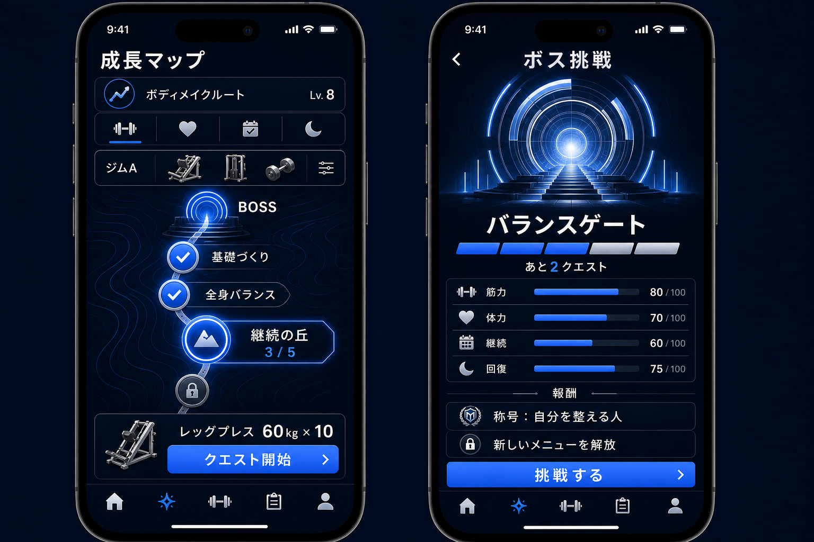

# BodyMode AIコーチ・SNS・収益化 統合設計

更新日: 2026-08-12

対象: iPhone / Apple Watch / ローカルLLM / 将来のクラウドサービス

## 1. 目的

BodyModeを、トレーニング記録アプリから「AIがユーザー専属コーチとして、運動・食事・身体・回復をつなぎ、次の行動まで支援するアプリ」へ拡張する。

SNS、ゲーミフィケーション、収益化は主目的にしない。以下の順序を守る。

1. 記録が簡単である
2. 状態と変化が理解できる
3. 次の行動が一つに絞られる
4. 継続を実感できる
5. 希望するユーザーだけが成果を共有できる
6. ユーザー体験を損なわない方法で収益化する

## 2. 今回の設計判断

| 論点 | 判断 |
|---|---|
| AIの役割 | 自動決定ではなく、根拠付きの下書き・提案・振り返りを担当する |
| AIコーチ | 毎日・毎週・毎月の時間軸を持ち、提案の採用・見送り・完了を追跡する |
| SNS | 自動投稿は行わず、ユーザー確認後に共有する |
| アプリ内コミュニティ | 記録機能から分離し、初期値を非公開にする |
| ランキング | 体重、体脂肪率、摂取量、絶対重量では競わせない |
| ゲーミフィケーション | 結果より習慣を評価し、休養日を失敗扱いしない |
| 広告 | HealthKit、身体、食事、写真、回復データを広告ターゲティングに使わない |
| スポンサー | 個人の健康データを提供しない。達成判定と応募を分離する |
| サブスク | デジタル機能の解放はStoreKitの自動更新サブスクリプションを使う |
| データ保存 | 記録はローカルファースト。コミュニティ公開データだけを明示的にクラウドへ送る |

## 3. 既存資産との対応

| 領域 | 現在のBodyMode | 拡張内容 |
|---|---|---|
| トレーニング | 計画、セット実績、PR、ボリューム、Apple Watch | AIによる次回調整案、月次評価 |
| 食事 | 写真、手動PFC、AI下書き | バーコード、日次食事提案、目標別評価 |
| 身体 | 体重、腹囲、体脂肪率、部位、週平均 | 部位別成長分析、月次目標評価 |
| 写真 | 定点写真、AIコメント | 比較カード、共有時の匿名化・トリミング |
| 回復 | 睡眠、HRV、安静時心拍、活動、主観疲労 | 日次ブリーフィングの負荷調整根拠 |
| AI | 食事下書き、体型コメント、週次レポート | 日次・週次・月次コーチ、行動追跡 |
| 共有 | 未実装 | 成果カード生成、システム共有 |
| コミュニティ | 未実装 | フォロー、反応、コメント、チャレンジ |
| 収益化 | 未実装 | サブスク、スポンサー企画、文脈型掲載、アフィリエイト |

## 4. プロダクト原則

### 4.1 一画面一判断

- ホームでは「今日、次に何をするか」を最優先にする。
- 数値を並べるだけでなく、状態、理由、次の行動の順に表示する。
- AI提案は同時に一つを主提案とし、補足は展開後に表示する。
- コミュニティや広告を記録導線より上に置かない。

### 4.2 AIは確認可能にする

すべてのAI出力に以下を持たせる。

- 対象期間
- 利用したデータカテゴリ
- 主要な根拠
- 信頼度またはデータ充足度
- 提案の有効期限
- 採用、見送り、修正
- 医療診断ではない旨

AIはユーザー確認なしに次の操作を行わない。

- トレーニング計画の上書き
- カロリー、PFC、身体測定値の確定
- 体型写真の公開
- SNS投稿
- チャレンジ参加
- 商品購入

### 4.3 継続を健康的に評価する

- 連続記録は、計画休養、体調不良、デロードを考慮する。
- 運動量や食事量を過度に増減させる行動へ報酬を付けない。
- 痛みや回復不足がある日は「休む」「軽くする」も達成として扱う。
- 体重や体型の優劣を競わせない。

## 5. 情報設計

### 5.1 現在の構成を崩さない導入

初期導入では現在のタブを維持する。

| 現在のタブ | 追加する情報 |
|---|---|
| ホーム | 今日のAIブリーフィング、主提案、継続状況 |
| 計画 | AI提案から作成した計画の確認画面 |
| 記録 | 食事、身体、写真、コンディションの入力 |
| 履歴 | 日次タイムライン、週次・月次レポート、成果カード |
| 種目 | 変更なし |

共有は新しいタブにせず、次の完了画面に置く。

- ワークアウト完了
- PR更新
- 週間レポート
- 月間レポート
- ビフォーアフター
- チャレンジ達成

### 5.2 将来の目標構成

コミュニティ導入時に、5タブを次へ再編する。

| タブ | 役割 |
|---|---|
| ホーム | AIブリーフィング、今日の行動、進行中チャレンジ |
| トレーニング | 計画、種目、開始、Apple Watch送信 |
| 記録 | 身体、食事、写真、コンディション |
| インサイト | 履歴、PR、分析、週次・月次レポート、実績 |
| コミュニティ | フィード、フォロー、チャレンジ |

設定とプロフィールはホーム右上へ移す。タブ再編はナビゲーションUIテストを追加してから実施する。

## 6. AIコーチ設計

### 6.1 日次ブリーフィング

表示内容:

1. 今日の状態: 好調、通常、慎重、休養推奨
2. 根拠: 睡眠、回復、直近負荷、主観疲労、予定
3. 今日の主提案
4. 食事の確認点
5. 実行ボタン

主提案例:

- 予定どおり実施
- 重量を5%下げる
- セットを1つ減らす
- 軽い有酸素へ変更
- 休養し、睡眠記録だけ行う

### 6.2 週次レポート

既存の週次AIコメントを次の構造へ拡張する。

| セクション | 内容 |
|---|---|
| 要約 | 今週を一文で表す |
| 良かった点 | 継続、負荷、回復、栄養の肯定的変化 |
| 注意点 | 停滞、偏り、欠測、回復不足 |
| 根拠 | 体重、腹囲、写真、食事、運動、回復の差分 |
| 次週の主行動 | 一つだけ選ぶ |
| 補助行動 | 最大二つ |
| 共有 | 個人情報を除いた成長カードを生成 |

### 6.3 月次レビュー

- 月初目標と実績の差
- トレーニング頻度、達成率、PR
- 体重、腹囲、写真の傾向
- 食事記録率とPFC傾向
- 睡眠、回復、活動傾向
- 達成した習慣
- 来月目標の提案

来月目標はユーザーが確定するまで保存しない。

### 6.4 AI処理パイプライン



LLMへ計算を任せすぎない。

- PR、ボリューム、達成率、PFC、週平均はアプリ側で計算する。
- LLMは要約、優先順位付け、表現調整を担当する。
- LLM停止時はルールベースの短い提案へフォールバックする。
- AIプロバイダは`CoachProvider`境界で差し替え可能にする。

## 7. 食事・身体・写真の拡張

### 7.1 バーコード

- AVFoundationでバーコードを読み取る。
- 商品候補と一食量を表示し、ユーザーが確定する。
- 商品DBが見つからない場合は手動入力へ戻す。
- 商品栄養値と実際に食べた量を分離して保存する。

### 7.2 AI食事提案

- 当日の不足または過剰を示す。
- 特定の商品購入を先に提案しない。
- 食事の選択肢を複数提示する。
- アレルギーや医療的制限の判断は行わない。

### 7.3 体型写真

- 同じ角度、距離、姿勢、照明での撮影補助を優先する。
- AIは前回との差を観察し、体脂肪率を断定しない。
- 将来予測は「現在の傾向が続いた場合の数値シナリオ」に限定する。
- 実在する将来の体型であるかのような画像は生成しない。
- 共有前に顔、背景、撮影日時、位置情報を除去または確認する。

## 8. 成果カードと外部SNS共有

### 8.1 カード種別

- 今日の成果
- PR更新
- 継続日数
- 週間レポート
- 月間レポート
- ビフォーアフター
- チャレンジ達成

### 8.2 生成フロー

1. アプリが数値とグラフを端末内で描画する
2. AIがタイトルと投稿文の下書きを作る
3. 公開項目をユーザーが選ぶ
4. プレビューを表示する
5. iOSの共有シートを開く
6. ユーザーが共有先と投稿操作を確定する

MVPではX、Instagram、TikTok、YouTube Shorts、Discord、LINEへ個別ログインしない。画像、動画、テキストをシステム共有シートへ渡す。各サービスへの直接投稿APIは、共有率を確認してから個別に実装する。

### 8.3 公開範囲

初期値はすべてOFFにする。

- 体重
- 腹囲
- 体脂肪率
- 摂取カロリー
- PFC
- 心拍
- 睡眠
- 顔
- 体型写真
- ジム名と位置

カードには公開前チェックを必須とし、AIが勝手に公開項目を増やさない。

### 8.4 SNS応援ギフト

SNSの友達一覧をBodyModeへ取り込まず、一回限りのギフトリンクをDMや投稿で送る。送り主と受取人はSNSアカウントをBodyModeへ連携しなくてもよい。

ギフト候補:

| 種類 | 例 | 決済 |
|---|---|---|
| 無料応援 | 応援カード、限定バッジ、チャレンジ招待 | なし |
| デジタルギフト | AIコーチ7日パス、月次レポート利用券 | In-App Purchase |
| 運営配布 | キャンペーン用Coach Pass、サポート補填 | App StoreのOffer Code |
| 物理ギフト | スポンサー商品、ウェア、シェイカー | Apple Payまたは外部決済 |

基本フロー:

1. 送り主がギフトと定型メッセージを選ぶ
2. 有料デジタルギフトの場合はStoreKitで購入する
3. サーバーが購入検証後に一回限りのギフトを発行する
4. `https://bodymode.app/g/{token}`をiOS共有シートへ渡す
5. 受取人がSNS、LINE、Discord、メッセージなどからリンクを開く
6. 未インストール時は説明ページとApp Store導線を表示する
7. BodyModeへのログイン後、内容と送り主を確認して受取または辞退する
8. 受取後に権利または無料アイテムを付与する

設計ルール:

- リンクにSNS ID、メールアドレス、健康データを含めない。
- ギフトトークンは推測不能、一回限り、有効期限付きとし、サーバー側ではハッシュ化する。
- 最初に受取を確定したBodyModeアカウントへ付与し、付与後は譲渡できない。
- 送り主へ表示するのは`未受取 / 受取済み / 辞退 / 期限切れ`だけとし、受取人の記録や利用状況を見せない。
- 受取人は辞退、送り主のブロック、迷惑ギフトの通報ができる。
- 匿名で繰り返し送れないように、送信回数制限とブロックを適用する。
- ギフト受取をHealthKit権限、SNS投稿、レビュー投稿の条件にしない。
- 無理な運動、減量、食事制限を促進するアイテムは販売しない。

アプリ未インストール状態をまたぐため、Universal Linkだけに依存しない。Webの受取ページに短い受取コードも表示し、インストール後にコード入力でも復元できるようにする。

## 9. アプリ内コミュニティ

### 9.1 最小構成

- 公開プロフィール
- フォロー
- いいね
- 応援
- コメント
- チャレンジ
- 通報
- ブロック

UGCを提供する時点で、投稿フィルタ、通報、ブロック、問い合わせ先、運用者向けモデレーション画面を同時に用意する。

### 9.2 投稿モデル

投稿は自由入力を主役にせず、成果カードを中心にする。

- `achievement`: PR、継続、達成率
- `report`: 週次・月次まとめ
- `before_after`: ユーザーが明示選択した写真
- `challenge`: 参加、途中経過、達成
- `manual`: 短文と任意画像

### 9.3 ランキング

許可する候補:

- 記録継続日数
- 計画達成率
- チャレンジ達成率
- 応援数

禁止するランキング:

- 体重の軽さ・重さ
- 体脂肪率
- 摂取カロリーの少なさ
- 絶対重量
- 写真の見た目評価

## 10. ゲーミフィケーション

| 要素 | 仕様 |
|---|---|
| レベル | 記録、振り返り、計画達成、休養判断で経験値を得る |
| バッジ | 初回記録、4週継続、初PR、週次レビュー閲覧など |
| 称号 | 行動傾向を肯定的に表す。身体的優劣を表さない |
| 連続記録 | 計画休養と体調不良による休養を維持対象にできる |
| チャレンジ | 行動目標を中心にし、無理な減量や運動量を要求しない |
| シーズン | 任意参加。未参加ユーザーの記録体験を弱くしない |

報酬対象は「入力回数」だけにしない。不正な連打を避けるため、完了セッション、日次チェックイン、レビュー閲覧など意味のあるイベントに限定する。

### 10.1 成長マップ（将来検討・未実装）

日々の運動を、目的別ルート上の「クエスト」として表示する。マップは記録機能を置き換えず、継続を視覚化する任意の表示モードとする。

| 項目 | 方針 |
|---|---|
| ルート | 筋肥大、減量、体力、健康維持、体型改善、競技力向上、復帰支援から目的に合うものを選ぶ |
| ステージ | 基礎、初級、中級、上級、プロフェッショナル相当へ段階的に進む |
| クエスト | 重量・回数・距離・時間・RPE・回復行動を目的に応じて組み合わせる |
| 進行 | 完了セッション、計画達成、振り返り、適切な休養で経験値を得る |
| 表示 | 完了、現在地、次の目標、解放条件を一画面で把握できるようにする |
| 通常記録 | マップを使わないユーザーも従来どおり計画・記録・履歴を利用できる |

### 10.2 ジム設備への適応

- ユーザーは通っているジムごとに、マシン、フリーウェイト、有酸素設備、自重スペースを登録できる。
- クエスト生成時は利用可能な設備だけでメニューを構成する。
- マシンが空いていない場合は、同じ目的・部位・動作パターンの代替種目へ変更できる。
- 未登録の設備や種目だけを、その場で追加できる。
- 設備変更で難易度や経験値が不自然に上下しないよう、重量の絶対値ではなく達成度、RPE、推移を中心に評価する。

### 10.3 ボスチャレンジ

各ステージの終点に、複数の行動指標をまとめた節目のチャレンジを置く。対戦や攻撃を主題にせず、「自分の目標を突破するゲート」として表現する。

| 指標 | 判定例 |
|---|---|
| 筋力 | 設定した回数帯での重量または推定1RMの安定した向上 |
| 体力 | 距離、時間、心拍ゾーン、完遂率の改善 |
| 継続 | 無理のない頻度で計画を続けた期間 |
| 回復 | 睡眠、疲労度、休養判断を含むコンディション管理 |
| 技術 | RPEの安定、フォーム確認、ウォームアップなど安全行動の実施 |

- 性別、体格、絶対重量、体重減少量だけで有利・不利を作らない。
- 疲労や痛みが強い場合は挑戦延期を正しい選択として扱い、連続記録を失わせない。
- ボスの解放条件と評価根拠は事前に表示し、AIだけで合否を決めない。

### 10.4 報酬

- 即時報酬: 経験値、スタンプ、Watchの触覚フィードバック
- 節目報酬: 称号、バッジ、新しいメニューテンプレート、分析カード
- 継続報酬: 計画休養を含むストリーク、シーズン記録、成長マップ上の記念表示
- 称号は「継続の達人」「自分を整える人」のように行動を肯定し、身体的な優劣を表さない。
- ランダム課金、ガチャ、過度な希少性、不健康な運動を促す報酬は採用しない。

### 10.5 表現方針とUIコンセプト

- 筋肉質な男性キャラクターや戦闘・軍事的な世界観へ寄せない。
- 人型の敵ではなく、光のゲート、山頂、抽象的なモニュメントなど中性的な節目として表現する。
- 筋力だけでなく、体力、継続、回復を同じ重要度で見せる。
- 大きな文字とアイコン、明確な現在地、少ない説明文で、年齢を問わず操作しやすくする。
- 未達を失敗として強調せず、次に実行可能な一つの行動を示す。



この画像は方向性確認用であり、画面構成、名称、数値、報酬は確定仕様ではない。2026-08-12時点では設計記録のみとし、実装、バックログへの採番、リリース対象化は保留する。

## 11. 収益化

### 11.1 サブスクリプション

価格は固定せず、原価と継続価値を検証して決める。100〜500円/月は仮説として扱う。

| Free | Coach |
|---|---|
| 手動記録 | 日次AIブリーフィング |
| トレーニング計画・実績 | 週次・月次AIレポート |
| 身体・食事・写真記録 | 高度な相関分析 |
| 基本グラフ・PR | 成果カードの拡張テンプレート |
| Apple Watch基本記録 | AIによる次回計画下書き |

記録データの閲覧、エクスポート、削除、HealthKit連携の基本機能は課金で閉じない。

### 11.2 広告

BodyModeはHealthKit、身体測定、食事、写真、睡眠、回復、位置情報を広告選定へ使用しない。

許可する方式:

- 全ユーザーに同じスポンサー枠を表示する
- 表示中の一般カテゴリに応じた文脈型掲載
- ユーザーが自分で開いた商品検索・商品カテゴリ

禁止する方式:

- 「睡眠不足だからリカバリー商品」のような健康データ連動
- 「減量中だから低脂質商品」のような目的・身体情報連動
- HealthKitデータを広告事業者へ送る
- Watch、Widget、通知への広告掲載
- 記録操作を遮るインタースティシャル広告

掲載には「広告」「スポンサー」「アフィリエイト」を明示し、不適切広告の報告導線を設ける。

### 11.3 アフィリエイト

- 商品一覧はユーザー操作で開く独立画面にする。
- AIコーチの提案と商品紹介を同じカードに混在させない。
- 商品を勧める場合は広告・成果報酬であることを明示する。
- 健康データを第三者へ送らず、購入先には通常の遷移情報だけを渡す。
- 医療効果、治療、必須性をうたわない。

### 11.4 スポンサーチャレンジ

最初はスポンサーなしの「30日継続チャレンジ」で仕組みを検証する。継続率と不正率を確認後、スポンサー付きパイロットへ進む。

設計ルール:

- チャレンジの主催者はBodyMode運営者とする。
- 公式ルール、対象地域、期間、応募条件、景品、抽選方法を表示する。
- Appleが主催・関与していないことを明示する。
- スポンサーへ個別の健康データを提供しない。
- 応募とHealthKit権限を結び付けない。
- 無理な運動、急減量、摂取制限を条件にしない。
- 景品応募は行動達成イベントから生成した資格だけで判定する。

### 11.5 ギフト決済

- アプリ内で消費するAIコーチ利用権やデジタルアイテムのギフトはIn-App Purchaseを使う。
- StoreKitで購入可能なアイテムは他ユーザーへ贈ることができるが、返金先は購入者とし、現金や別商品へ交換できない。
- 購入トランザクションとギフト発行は一対一にし、同じ購入から複数のギフトを作れないようにする。
- 未受取ギフトの返金、受取後の返金、期限切れ時の扱いを利用規約と画面に明示する。
- 物理商品の購入はIn-App Purchaseを使わず、Apple Payまたは通常の決済を使う。
- App StoreのOffer Codeは運営配布やキャンペーン向けに使い、友達が代金を払って贈る仕組みとは分ける。

## 12. データ分類とプライバシー

| 分類 | 例 | 保存・共有 |
|---|---|---|
| Private Health | HealthKit、心拍、睡眠、身体値、食事、写真 | 原則端末内。AI送信はカテゴリ別同意 |
| Private Coaching | AI入力要約、提案、採否、目標 | 端末内または本人専用領域 |
| Share Draft | 成果カード、投稿文下書き | 端末内。公開前に確認 |
| Public Social | 公開プロフィール、投稿、コメント、反応 | コミュニティ用クラウド |
| Commerce | 購読権利、応募資格、広告表示記録 | 健康データと分離 |
| Moderation | 通報、ブロック、対応記録 | 運用者だけが参照 |

HealthKit由来データと広告・スポンサー識別子を同じ分析イベントへ載せない。公開用データはプライベート記録から直接参照せず、ユーザーが確定した`ShareArtifact`を複製して使う。

## 13. データモデル

### 13.1 AIコーチ

| モデル | 主な項目 |
|---|---|
| CoachBriefing | id, period, state, summary, evidenceIDs, dataCompleteness, generatedAt |
| CoachAction | id, briefingID, category, title, rationale, status, expiresAt |
| CoachActionEvent | actionID, eventType, occurredAt, userNote |
| CoachReport | id, periodType, periodStart, periodEnd, summary, sections, goals |
| CoachFeedback | reportID/actionID, helpfulness, reason, correctedText |

`CoachAction.status`は`proposed / accepted / dismissed / completed / expired`とする。

### 13.2 共有・実績

| モデル | 主な項目 |
|---|---|
| Achievement | id, type, earnedAt, sourceRecordID, displayValue |
| Streak | id, type, currentCount, bestCount, protectedUntil |
| ShareArtifact | id, type, renderedAssetPath, captionDraft, disclosedFields, createdAt |
| ShareEvent | artifactID, destinationHint, shareSheetOpenedAt |

共有完了は外部SNSから取得できない場合があるため、システム共有シートを開いた時点とユーザー任意の完了確認を分ける。

### 13.3 コミュニティ

| モデル | 主な項目 |
|---|---|
| PublicProfile | userID, handle, displayName, avatarURL, bio, visibility |
| Post | id, authorID, type, artifactURL, caption, visibility, createdAt |
| Reaction | postID, userID, type, createdAt |
| Comment | id, postID, authorID, body, status, createdAt |
| Follow | followerID, followeeID, status, createdAt |
| UserBlock | blockerID, blockedID, createdAt |
| ContentReport | id, reporterID, targetType, targetID, reason, status |

### 13.4 チャレンジ・収益

| モデル | 主な項目 |
|---|---|
| Challenge | id, ownerType, title, ruleType, startAt, endAt, termsVersion |
| ChallengeEnrollment | challengeID, userID, joinedAt, consentVersion |
| ChallengeProgress | enrollmentID, progress, verifiedAt, sourceType |
| RewardEligibility | enrollmentID, status, determinedAt, auditReason |
| SubscriptionEntitlement | productID, status, expiresAt, source |
| SponsorPlacement | id, sponsorID, creative, context, startAt, endAt |
| AffiliateDisclosure | placementID, disclosureText, destinationDomain |

### 13.5 ギフト

| モデル | 主な項目 |
|---|---|
| GiftProduct | id, kind, title, entitlementType, durationDays, storeProductID |
| GiftPurchase | id, purchaserUserID, storeTransactionID, productID, status, purchasedAt |
| GiftGrant | id, purchaseID, tokenHash, senderUserID, recipientUserID, status, expiresAt |
| GiftMessage | giftGrantID, templateID, optionalText, moderationStatus |
| GiftClaimEvent | giftGrantID, eventType, actorUserID, occurredAt |

`GiftGrant.status`は`created / shared / claimed / declined / expired / revoked / refunded`とする。健康データとSNSアカウントIDはギフトモデルへ保存しない。

## 14. サービス境界

現在の`AppStore`とローカルJSONを急に置き換えない。次のRepository境界を追加し、ローカル実装から段階的に移行する。

```text
WorkoutRepository
BodyRepository
MealRepository
PhotoRepository
CoachRepository
AchievementRepository
CommunityRepository
CommerceRepository
GiftRepository
```

- 健康・記録Repositoryはローカルファーストを維持する。
- `CommunityRepository`だけが公開データ用APIへ接続する。
- `CommerceRepository`はStoreKitとスポンサー資格を扱い、健康記録本文を受け取らない。
- `GiftRepository`は購入検証、一回限りリンク、受取、期限、返金状態を扱う。
- `CoachRepository`はローカルLLMと将来の外部AIを同じ構造化レスポンスへ変換する。

## 15. イベント設計

健康値そのものを分析イベントへ含めない。

| イベント | 属性例 |
|---|---|
| `coach_briefing_viewed` | period, dataCompletenessBucket |
| `coach_action_accepted` | category, source |
| `coach_action_completed` | category, elapsedBucket |
| `report_generated` | periodType, provider, success |
| `share_preview_opened` | artifactType |
| `share_sheet_opened` | artifactType |
| `challenge_joined` | challengeID, sponsorFlag |
| `challenge_completed` | challengeID |
| `subscription_started` | productID, offerType |
| `gift_link_created` | giftProductID, paidFlag |
| `gift_claimed` | giftProductID, paidFlag, elapsedBucket |
| `content_reported` | targetType, reasonCode |

体重、心拍、睡眠時間、食事内容、写真特徴、位置はイベント属性に入れない。

## 16. KPI

### コア価値

- 初回記録完了率
- 7日後、30日後継続率
- 週あたり記録日数
- Watchセッション完了率
- 食事、身体、写真の記録継続率

### AIコーチ

- 日次ブリーフィング閲覧率
- 主提案採用率
- 採用後完了率
- 週次・月次レポート閲覧率
- 提案の役立ち評価
- AI修正率、却下率

### 継続・共有

- 成果カード生成率
- 共有プレビューから共有シートへの遷移率
- ギフトリンク作成率、共有率、受取率
- ギフト受取から7日後の継続率
- チャレンジ参加率、完了率
- チャレンジ参加群と非参加群の継続率差

### コミュニティ・安全

- 投稿者率、応援率、コメント率
- 通報率、ブロック率
- 通報対応時間
- 公開後の削除率

### 収益

- FreeからCoachへの転換率
- 無料体験完了率
- 月次継続率
- AI推論・保存・モデレーションの一人当たり原価
- 広告非表示率、広告報告率

## 17. 段階リリース

| Phase | 目的 | 範囲 |
|---|---|---|
| 0 | 現在の基盤を安定化 | 記録、Apple Watch、回復、AI週次、実機検証 |
| 1 | AI伴走価値を検証 | 日次ブリーフィング、CoachAction、週次改善、成果カード |
| 2 | 継続支援を検証 | 月次レビュー、実績、健康的なストリーク、バーコード |
| 3 | 共有需要を検証 | 共有テンプレート、無料応援ギフト、ビフォーアフター匿名化、共有KPI |
| 4 | コミュニティ最小版 | アカウント、投稿、フォロー、反応、通報、ブロック |
| 5 | チャレンジを検証 | スポンサーなしチャレンジ、資格判定、運用管理 |
| 6 | 収益化 | StoreKitサブスク、有料デジタルギフト、スポンサー付きパイロット、文脈型掲載 |
| 7 | 将来拡張 | Garmin、体重計、フォーム動画、トレーナー、法人 |

スポンサー付きチャレンジを最初のMVPへ入れると、アカウント、バックエンド、不正対策、規約、景品運用、モデレーションが同時に必要になる。そのため、MVPでは同じUXをスポンサーなしで検証し、継続率の改善を確認してからスポンサーを接続する。

## 18. リリースゲート

### AIコーチ

- AI停止中も記録とルールベース提案が利用できる
- 提案の根拠と利用データカテゴリが確認できる
- 計画変更はユーザー確定後にだけ保存される
- 不適切な医療表現を検出・除外する

### 共有

- 公開項目の初期値がOFF
- 顔、位置、撮影メタデータを確認できる
- 投稿前プレビューがある
- 外部投稿はユーザー操作で完了する

### コミュニティ

- 通報、ブロック、投稿フィルタ、問い合わせ先が揃う
- 非公開ユーザーがすべての記録機能を使える
- 削除要求が投稿・コメント・画像へ反映される

### 収益化

- HealthKitや健康データを広告に使用しない
- サブスク解約後も本人の記録を閲覧・出力できる
- 広告・スポンサー・アフィリエイト表示が明確
- チャレンジ公式ルールとApple非関与表示がある

### ギフト

- ギフトリンクが一回限りで、有効期限と推測不能なトークンを持つ
- 受取前に送り主、内容、有効期間を確認できる
- 受取人が辞退、通報、ブロックできる
- 送り主へ受取人の健康情報や利用状況を返さない
- デジタルギフトはStoreKit購入検証後にだけ発行される
- 返金、期限切れ、重複受取、アカウント削除の結合テストが通る

## 19. Apple審査上の前提

- [App Review Guidelines](https://developer.apple.com/app-store/review/guidelines/)に従う。
- HealthKit、Motion & Fitnessなどの健康・フィットネスデータを広告、マーケティング、利用ベースのデータマイニングへ使わない。
- UGCには不適切コンテンツのフィルタ、通報、ブロック、連絡先を用意する。
- デジタル機能のサブスクリプションはIn-App Purchaseを使用する。
- アプリ内で消費するデジタルギフトはIn-App Purchaseを使用し、物理商品には別の決済を使用する。
- 懸賞・コンテストは運営者が主催し、公式ルールとAppleが関与しない旨を表示する。
- 審査ガイドラインと対象地域の法令はリリース前に再確認する。
