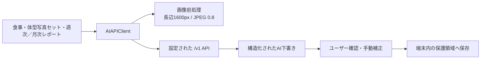

# AI APIサーバー連携設計

更新日: 2026-08-10

## 目的

BodyModeの食事画像、食べたものリスト、体型写真、週次記録を、ユーザーが設定したAI APIへ送信し、構造化された下書きと提案を受け取る。AI未接続時も、手動記録・編集・保存は継続できる。

## 構成

## エンドポイント

| 機能 | API | タイムアウト | アプリでの扱い |
|---|---|---:|---|
| 接続確認 | `GET /v1/health` | 15秒 | CalorieCLIP、補助モデルの利用可否を表示 |
| コーチ一覧 | `GET /v1/coaches` | 15秒 | 接続確認時に取得し、利用可能数を検証 |
| 食事画像 | `POST /v1/meals/analyze-image` | 120秒 | 料理名・カロリー・PFCへ反映後、ユーザーが修正 |
| 食べたものリスト | `POST /v1/meals/analyze-text` | 120秒 | 最大20件の食品名・量から食品別と合計の推定値を反映後、ユーザーが修正 |
| 体型写真1枚 | `POST /v1/body-photos/analyze` | 120秒 | 旧ビルドとの互換用。1方向の参考コメントを返す |
| 体型写真セット | `POST /v1/body-photos/analyze-set` | 120秒 | 同日の最大4方向をまとめて分析し、追加後も再分析できる |
| 週次レポート | `POST /v1/reports/weekly` | 120秒 | 選択コーチと許可済みカテゴリだけを送信・保存 |
| 月次レビュー | `POST /v1/reports/monthly` | 120秒 | 直近30日の下書きを返し、アプリで確認・修正後だけ保存 |
| AIトレーナー | `POST /v1/agents/chat` | 120秒 | 許可済み記録の要約と承認済み記憶で回答を生成 |

全リクエストへ`Authorization: Bearer <API key>`、`Content-Type: application/json`、`Accept: application/json`を付ける。画像Base64にはData URLプレフィックスを付けない。

## 写真なしの食事推定

1. ユーザーは食べたものを1件ずつ入力し、分かる場合は`白ごはん 150g`のように量も書く。
2. `gemma4:12b`が食品名と量を構造化し、厳格なJSON Schemaで食品別のカロリーとPFCを返す。
3. APIサーバーが食品別の値を合計し直し、食事全体のカロリーとPFCを返す。
4. アプリは結果を入力欄へ下書きし、ユーザーが修正・確認してから保存する。

量がない食品は一般的な1食分を仮定し、`confidence`を下げる。モデルの知識だけによる栄養値は参考値であるため、次段階では日本食品標準成分表のローカルDBを正とし、モデルは食品名の正規化と候補選択だけを担当する。

## 設定と秘密情報

- Base URLとAPIキーは設定画面から変更できる。
- APIキーはKeychainの`WhenUnlockedThisDeviceOnly`で保存する。
- Base URLは端末内の保護済み設定領域へ保存する。
- 開発・配布ビルドの初期値は`Config/AIService.local.xcconfig`から注入する。このファイルはGit管理外とする。
- Quick TunnelのURL変更時は設定画面で更新でき、コード変更は不要。
- モバイルアプリへ配布した共有APIキーは完全な秘密にはできない。公開範囲を広げる際は、ユーザー単位の短命トークンと失効・レート制限をサーバー側へ追加する。

## 画像とプライバシー

- 送信前に向きを反映して再描画し、長辺1600px以下、JPEG品質0.8へ変換する。
- 再エンコードにより位置情報などの元画像メタデータを送信データへ含めない。
- AI利用とカテゴリ別共有がオンの場合だけ、ユーザー操作を起点に送信する。
- 食事画像・体型写真・週次／月次レポートの送信結果を、内容を含めず「送信中・完了・失敗」として端末内へ記録する。
- 体型写真は同じ日付の撮影セットとして端末内で管理する。AIサーバーへは選択した最大4枚だけを一時送信し、サーバー側へ保存しない。

## エラーと復旧

| 状態 | 表示・挙動 |
|---|---|
| `401` | APIキー不正を表示し、設定確認を促す |
| `413` | AIトレーナーのコンテキストを縮小して1回だけ再送する |
| `422` | AIトレーナーのリクエスト形式不正を表示する |
| `503` | モデル利用不可または画像解析失敗を表示し、再試行を促す |
| タイムアウト・ネットワーク | 「AIサーバーに接続できません。時間をおいて再試行してください」と表示 |
| JSON不整合 | APIバージョン確認を促す |
| すべてのAI失敗 | 入力内容と写真を保持し、手動補正・保存を可能にする |

診断ログにはHTTP状態と障害カテゴリだけを残し、APIキー、画像、食事内容、身体データ、自由記述は記録しない。
