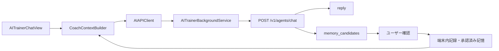

# AIトレーナー連携設計

更新日: 2026-08-11

## 目的

BodyModeの端末内記録とユーザーが承認した記憶を会話ごとに組み立て、ステートレスなAIトレーナーへ送る。サーバーに会話状態を持たせず、継続性・確認・削除の主導権をiPhone側へ置く。

## 構成

計画作成では同じ`POST /v1/agents/chat`を利用し、`AIPlanCoachView`が目標、直近記録、承認済み記憶、利用可能器具、登録済み種目を送る。AIの返答は計画用JSONとして端末側で検証し、`PlanEditorView`へ下書きとして渡す。

## API

- `POST /v1/agents/chat`
- `Authorization: Bearer <API key>`
- `Content-Type: application/json`
- タイムアウト: 120秒
- ストリーミングなし。レスポンス完了後に`reply`を表示する。
- コーチIDは`fat_loss`、`hypertrophy`、`strength`、`body_recomposition`、`wellness`、`return_to_training`。

Base URLとAPIキーは既存のAI設定を利用し、設定画面から変更できる。Quick TunnelのURLはコードへ固定しない。

## バックグラウンド実行

- チャット送信は識別子`com.yukitoshim.gymtrainingapp.ai-trainer.background`のバックグラウンド`URLSession`を使う。
- リクエスト本文はファイル保護付きの一時JSONへ保存し、完了または失敗後に削除する。
- 送信中に画面を閉じても処理を継続し、OSがアプリを再起動した場合は`AppDelegate`から完了イベントを受け取る。
- 回答、失敗、記憶候補は保護された状態ファイルへ一時保存し、次回のアプリ起動時に`AppStore`へ反映する。
- アプリが前面にない時は、回答完了または失敗をローカル通知する。
- 413時の縮小再送もバックグラウンドセッション上で1回だけ行う。
- APIキーはアプリ独自の保留状態ファイルへ保存せず、OSが管理するURLリクエストにだけ付与する。

これはサーバー応答を待つHTTP通信の継続であり、iPhone上でLLM推論を常時実行する仕組みではない。

## コンテキスト

`CoachContextBuilder`は、ユーザーがAI共有設定で許可したカテゴリだけを次の単位へ集計する。

- `recent_7_days`: 種目別セット、食事日計、身体KPI、体型写真コメント、回復、活動、ジム訪問、センサー要約
- `recent_4_weeks`: 週ごとの回数、セット、ボリューム、食事、身体KPI平均
- `long_term_trends`: 1年以内の身体変化とトレーニング集計
- `personal_records`: 種目別の最高実績
- `goals`、`preferences`: 目的、目標像、重点部位、目標値、担当コーチ、経験、希望頻度、利用可能器具、単位
- `memories`: ユーザーが承認済みの記憶
- `previous_suggestion`: 最新の週次提案

自由入力は4,000文字以内、会話履歴は直近20件まで、コンテキストと会話履歴はJSON換算で約60,000文字以内に制限する。413を受けた場合は、詳細件数と会話履歴を縮めて1回だけ再送する。再度413なら再送を止め、ユーザーへ整理を促す。

## 端末内保持

- 会話は保護されたアプリ領域へ最大200件保存する。
- 記憶は最大100件保存する。
- `memory_candidates`は既存記憶との重複を除外して確認画面へ出し、初期状態では未選択とする。
- ユーザーが選択して保存した候補だけ、次回以降の`context.memories`へ含める。
- 会話と記憶は別々に削除でき、全データ削除とJSON書き出しにも含める。
- 現行バックエンドは会話、コンテキスト、記憶をDBやファイルへ保存しない。

## エラー

| 状態 | 動作 |
|---|---|
| `401` | APIキー不正を表示し、設定確認を促す |
| `413` | 集計・縮小して1回再送。再失敗時は履歴整理を促す |
| `422` | リクエスト形式不正を表示する |
| タイムアウト・通信失敗 | 「AIトレーナーに接続できません。時間をおいて再試行してください」と表示する |

診断ログとAI送信履歴には障害カテゴリ、送信カテゴリ、件数、成否だけを残し、会話本文、記憶、APIキー、健康値は記録しない。

## AI計画の確認ルール

- AIはプロフィールで選択された器具に対応する登録済み種目だけを候補として受け取る。
- 未登録の種目名は端末側で除外し、すべて除外された場合は保存へ進めない。
- セット数は1〜10、回数は1〜100、重量は種目の入力範囲内、休憩は5〜600秒かつ5秒刻みに補正する。
- 既存計画の修正では計画IDと作成日を維持する。
- AIの返答を直接保存せず、必ず`PlanEditorView`で重量・回数・種目を確認してから保存する。
- `memory_candidates`は会話と同様に自動保存せず、ユーザーが承認した候補だけ記憶へ追加する。
