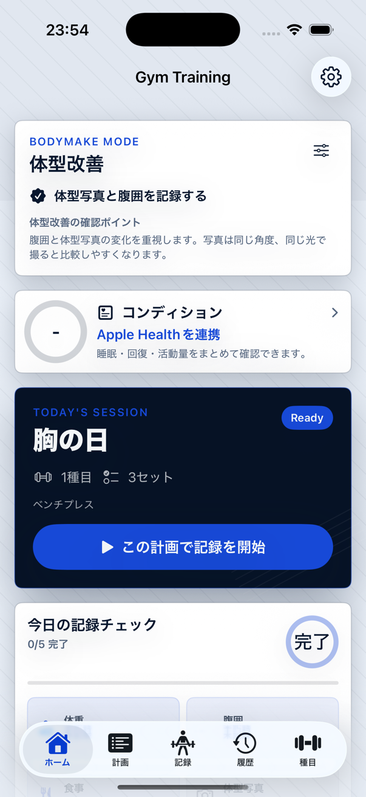
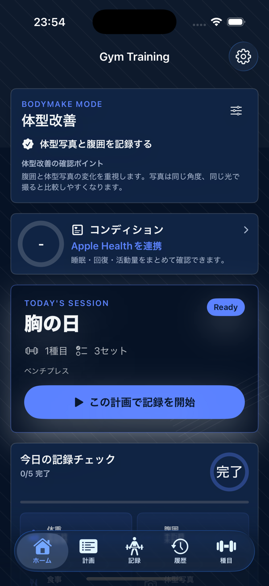
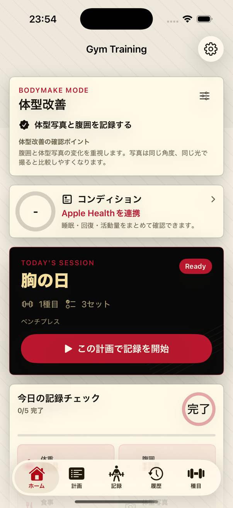
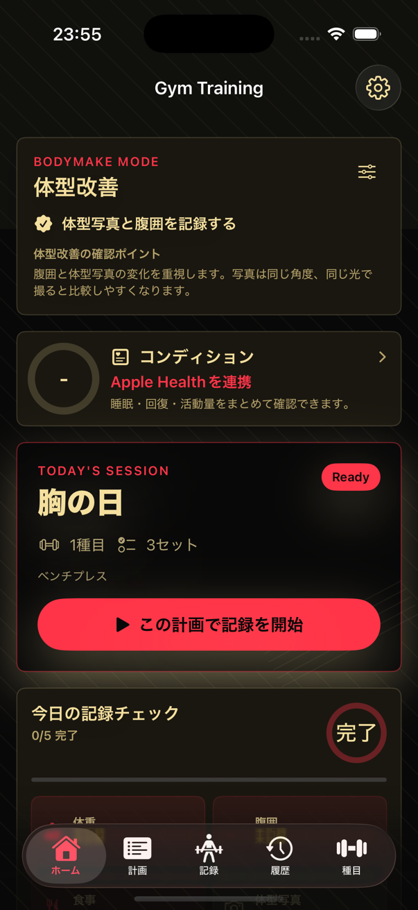

# カラーテーマ設計

更新日: 2026-07-19

## 選択可能なテーマ

| ID | 名称 | ベース | 明色 | アクセント | 印象 |
|---|---|---|---|---|---|
| B | ロイヤルコバルト | ミッドナイトネイビー | フロスト | コバルト | 知的・高貴・先進的 |
| D | ブラックシャンパン | ピアノブラック | シャンパン | レーシングレッド | 重厚・高級・刺激的 |

設定画面の「表示」でテーマと、システム連動・ライト・ダークを選択する。設定は端末へ保存し、メニュー同期時にApple Watchへも送る。

## 運用ルール

- UIの色はベース、明色、アクセントの3系統だけを使う。
- 機能ごとに赤、緑、青、紫を割り当てない。
- 成功・警告・失敗は色だけで区別せず、アイコンと文言を併用する。
- 複数系列は同系色の濃度、線種、太さ、ラベルで区別する。
- アクセントは主要操作、選択中、重要なライブ指標へ限定する。
- SwiftUI標準色を直接指定せず、`AppTheme`または`WatchAppTheme`を使う。

## コントラスト

WCAGの通常文字基準`4.5:1`を下限とする。

| 表示 | 本文/背景 | 補助文/背景 | アクセント/背景 | ボタン文字/アクセント |
|---|---:|---:|---:|---:|
| B ライト | 15.49 | 5.21 | 6.11 | 6.46 |
| B ダーク | 17.11 | 9.34 | 5.43 | 5.19 |
| D ライト | 16.38 | 5.87 | 5.77 | 6.24 |
| D ダーク | 15.16 | 8.07 | 5.57 | 5.57 |

## 実画面

### B ロイヤルコバルト

### D ブラックシャンパン

