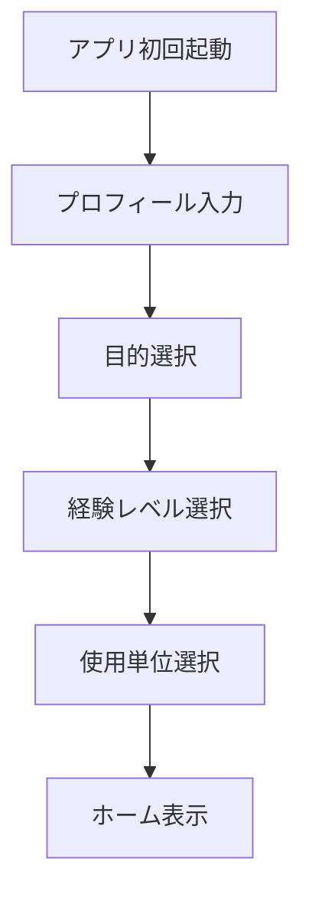
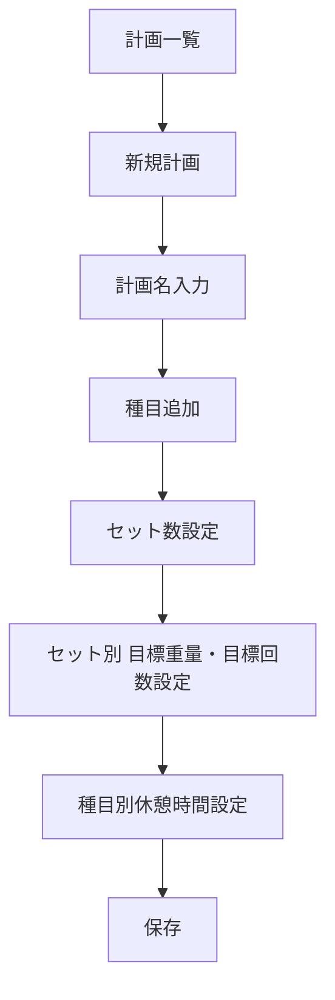
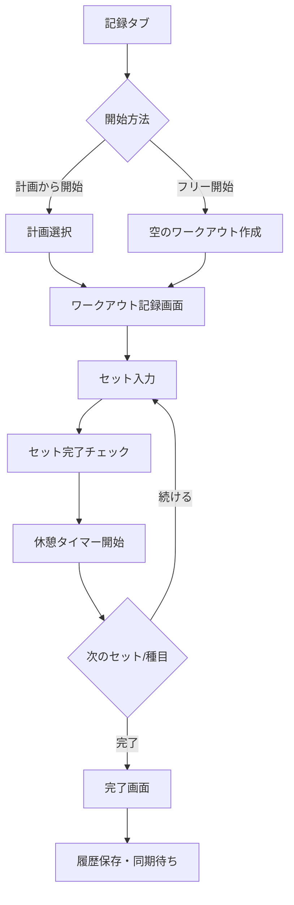
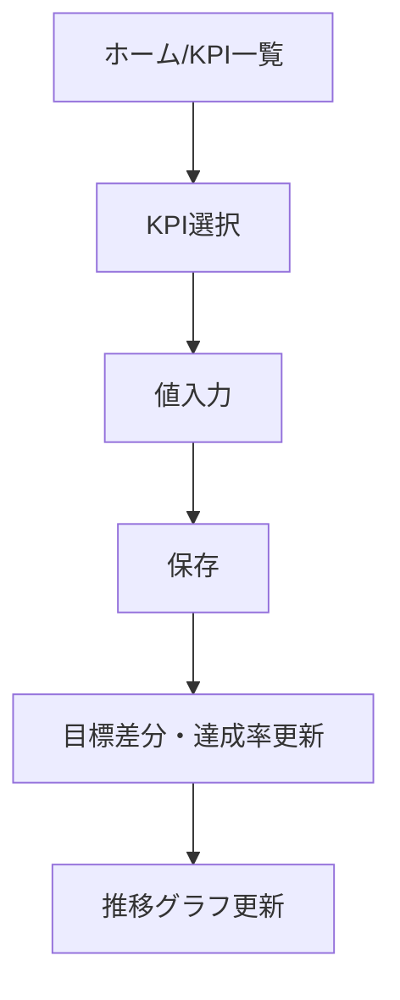
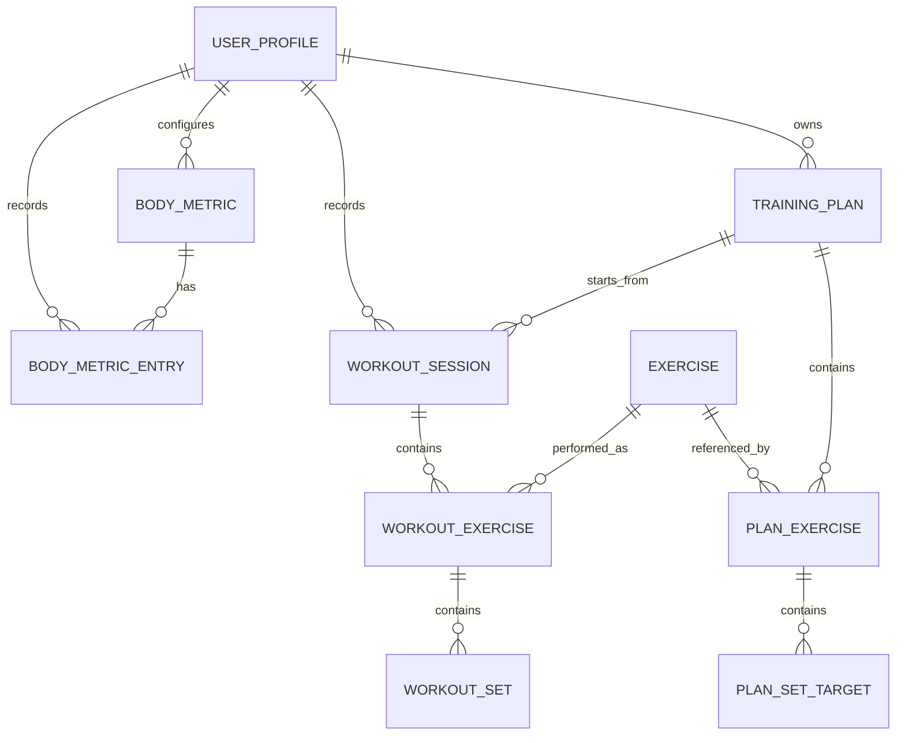
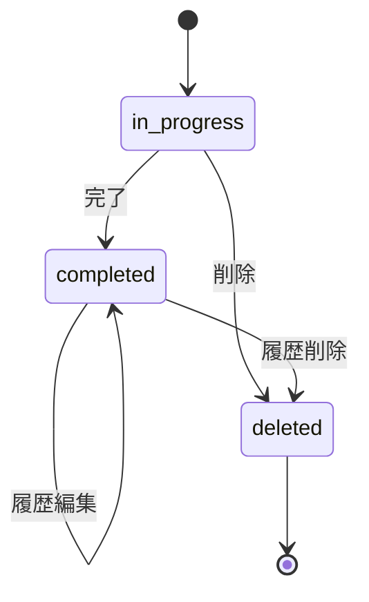
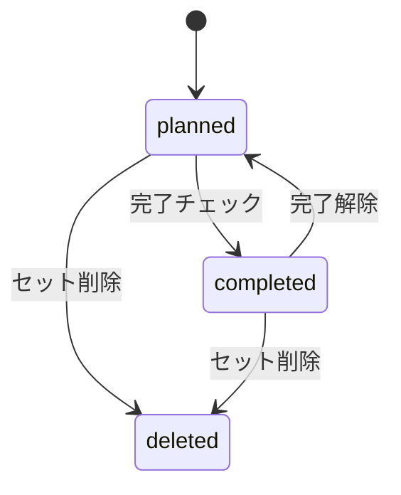
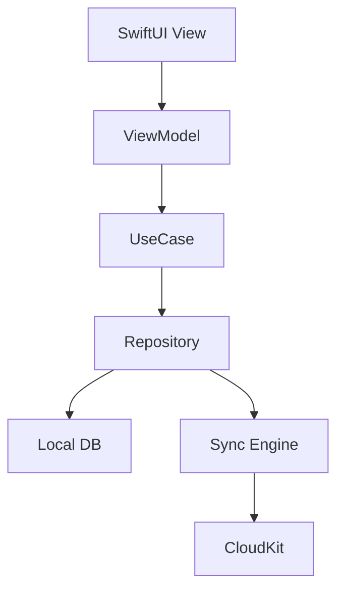

# トレーニング記録アプリ MVP設計書

作成日: 2026-06-13  
対象: iPhoneアプリ MVP  
元資料: `gym_training_app_user_stories_mvp.md`

## 1. 概要

本アプリは、ジムでの筋力トレーニングを「計画」「実績」「差分」「身体KPI」「次回計画」まで一連のサイクルとして管理するiPhoneアプリである。

MVPでは、単なる記録メモではなく、以下の体験を成立させることを目的とする。

1. 事前にトレーニング計画を作る
2. 計画を選んでワークアウトを開始する
3. セットごとの目標重量・目標回数に対して実績を入力する
4. 目標との差分・達成率を確認する
5. 過去履歴と種目別の成長を確認する
6. 体重・腹囲などの身体KPIを記録し、目標との差分と推移を見る
7. オフラインでも記録でき、クラウド同期で記録を失わない

## 2. MVPスコープ

### 2.1 MVP対象

| 領域 | 主な機能 | 対象US |
|---|---|---|
| 初期設定・プロフィール | 身長・体重・性別・年齢、目的、経験レベル、単位設定 | US-001〜004 |
| 種目データベース | 種目一覧、検索、詳細、カスタム種目追加 | US-007〜010 |
| メニュー・計画作成 | メニュー名、種目追加、並べ替え、セット別目標回数・重量 | US-015〜019, US-107〜111 |
| ワークアウト記録 | 計画から開始、フリー開始、セット記録、前回値、追加・削除・スキップ | US-025〜032, US-112〜117 |
| 休憩タイマー | セット完了後の自動開始、種目別休憩時間、通知 | US-041〜043 |
| 履歴 | 履歴一覧、カレンダー、詳細、編集、削除、種目別履歴 | US-046〜051 |
| 進捗分析 | 総ボリューム、種目別グラフ、自己ベスト | US-053〜055 |
| 身体KPI | KPI項目、体重・腹囲、部位、単位、目標、差分、推移、週次平均、達成率 | US-062, US-126〜128, US-130〜133, US-140〜144 |
| データ管理 | クラウド同期、全データ削除 | US-088, US-092 |
| 設定・UX | 無料利用、ダークモード、片手操作、前回値コピー、オフライン、誤操作防止 | US-093, US-097〜101 |

### 2.2 MVP対象外

以下はMVPでは設計上の拡張余地のみ確保し、画面・ロジック実装は行わない。

- ジム器具登録、曜日設定、リマインダー
- 種目のお気に入り、非表示、別名統合、動画・画像
- RPE/RIR、セット種別、自重・補助重量、時間・距離種目
- Apple Health / Apple Watch / Live Activities / Widget
- AI提案、停滞検知、過負荷チェック
- SNS共有、友人フォロー
- CSV出力、データ取り込み、自動バックアップ
- 有料機能、買い切りプラン

## 3. 想定ユーザーと利用シーン

### 3.1 想定ユーザー

- 週2〜5回ジムに通う筋トレ初心者〜中級者
- 毎回の重量・回数を伸ばしたいユーザー
- 減量・増量に合わせて体重や腹囲も追いたいユーザー
- ジム内で短時間・片手で入力したいユーザー

### 3.2 主要利用シーン

| シーン | ユーザー行動 | アプリが提供する価値 |
|---|---|---|
| 初回起動 | プロフィールと目的を登録 | 表示単位・分析の基礎を作る |
| ジム前 | 今日の計画を確認・調整 | 迷わず開始できる |
| トレーニング中 | セットごとに重量・回数を入力 | 前回値と目標差分を見ながら進められる |
| セット間 | 休憩タイマーを見る | 休憩時間を一定に保てる |
| トレーニング後 | 達成率と総ボリュームを見る | 今日の出来をすぐ把握できる |
| 日常 | 体重・腹囲などを記録 | 目標への進捗を確認できる |
| 振り返り | 履歴・グラフを見る | 成長や停滞を把握できる |

## 4. 情報設計

### 4.1 タブ構成

MVPでは下部タブを5つにする。

| タブ | 役割 | 主な画面 |
|---|---|---|
| ホーム | 今日の状態と主要KPI確認 | ダッシュボード、主要KPI、最近のワークアウト |
| 計画 | メニュー・トレーニング計画管理 | 計画一覧、計画詳細、計画編集 |
| 記録 | ワークアウト開始・実行 | 開始方法選択、ワークアウト記録画面 |
| 履歴 | 過去ワークアウト確認 | 履歴一覧、カレンダー、履歴詳細、種目別履歴 |
| 分析 | グラフ・KPI確認 | 種目別グラフ、総ボリューム、KPIグラフ |

設定画面はホーム右上の歯車アイコンから遷移する。

### 4.2 画面一覧

| 画面ID | 画面名 | 概要 |
|---|---|---|
| S-001 | オンボーディング | 初回起動時にプロフィール・目的・経験・単位を登録 |
| S-002 | ホーム | 主要KPI、直近ワークアウト、今日開始する計画への導線 |
| S-003 | 種目一覧 | 部位別の種目一覧、検索 |
| S-004 | 種目詳細 | 対象部位、器具、やり方、履歴導線 |
| S-005 | カスタム種目作成 | 種目名、部位、器具、説明を登録 |
| S-006 | 計画一覧 | 登録済み計画の一覧、作成、開始 |
| S-007 | 計画詳細 | 計画内の種目・セット目標・休憩時間を表示 |
| S-008 | 計画編集 | 種目追加、並べ替え、セット別目標値編集 |
| S-009 | ワークアウト開始 | 計画から開始、フリー開始を選択 |
| S-010 | ワークアウト記録 | セット入力、前回値コピー、達成状態、休憩タイマー |
| S-011 | ワークアウト完了 | 全体達成率、種目別達成率、総ボリューム |
| S-012 | 履歴一覧 | 日付順のワークアウト一覧 |
| S-013 | カレンダー | トレーニング実施日のカレンダー表示 |
| S-014 | 履歴詳細 | 過去の重量・回数・メモ、編集、削除 |
| S-015 | 種目別履歴 | 特定種目の履歴とグラフ |
| S-016 | 分析トップ | 総ボリューム、自己ベスト、種目別導線 |
| S-017 | KPI一覧 | 登録済みKPIの現在値・目標差分 |
| S-018 | KPI記録 | 体重・腹囲などの値を入力 |
| S-019 | KPI詳細 | 推移グラフ、週次平均、達成率 |
| S-020 | 設定 | 単位、ダークモード、通知、データ削除 |

## 5. 主要ユーザーフロー

### 5.1 初回設定



### 5.2 計画作成



### 5.3 ワークアウト記録



### 5.4 KPI記録



## 6. 機能設計

### 6.1 初期設定・プロフィール

#### 入力項目

| 項目 | 型 | 必須 | 備考 |
|---|---|---:|---|
| 身長 | Decimal | 任意 | cm。未入力でも利用可能 |
| 体重 | Decimal | 任意 | 初期KPI記録としても保存 |
| 性別 | Enum | 任意 | male / female / other / no_answer |
| 生年月日または年齢 | Date or Int | 任意 | MVPでは年齢入力でも可 |
| 目的 | Enum | 必須 | hypertrophy / fat_loss / strength / health |
| 経験レベル | Enum | 必須 | beginner / intermediate / advanced |
| 重量単位 | Enum | 必須 | kg / lb |
| 長さ単位 | Enum | 必須 | cm / inch |

#### 振る舞い

- 初回設定完了前はホームに入れない。
- 体重が入力された場合、`body_metric_entries` に初回体重として保存する。
- 単位変更時は既存データの保存値は基準単位で保持し、表示時に変換する。

### 6.2 種目データベース

#### 機能

- 部位別の種目一覧表示
- 種目名検索
- 種目詳細表示
- カスタム種目追加

#### 種目マスタ

初期データとして、主要なジム種目をアプリ内DBに同梱する。MVPではサーバー管理画面は対象外。

| 項目 | 内容 |
|---|---|
| 種目名 | ベンチプレス、スクワットなど |
| 主対象部位 | chest / back / legs / shoulders / arms / core / full_body |
| 副対象部位 | 任意、複数 |
| 器具 | barbell / dumbbell / machine / cable / bodyweight / other |
| 説明 | 短い実施方法 |
| カスタム種目フラグ | ユーザー作成かどうか |

#### 検索仕様

- 前方一致・部分一致に対応する。
- MVPでは日本語表記ゆれ・別名統合は対象外。
- カスタム種目も検索対象に含める。

### 6.3 計画・メニュー作成

#### 概念

ユーザーストーリー上は「メニュー」と「計画」が登場するが、MVPでは同一概念として扱う。  
内部名称は `training_plans` とし、UI表示は「計画」または「メニュー」とする。

#### 計画の構成

- 計画名
- 種目の並び順
- 種目ごとの休憩時間
- セットごとの目標重量
- セットごとの目標回数

#### 編集ルール

- 計画の更新は次回以降のワークアウトに反映する。
- すでに保存済みの履歴は、開始時点の目標値をスナップショットとして保持する。
- 前回実績から計画を作る場合、直近のワークアウト実績を目標値として複製する。

### 6.4 ワークアウト開始・記録

#### 開始方法

| 開始方法 | 内容 |
|---|---|
| 計画から開始 | `training_plan` を選択し、目標値をコピーして `workout_session` を作成 |
| フリー開始 | 計画なしの空セッションを作成し、種目を追加しながら記録 |

#### 記録項目

| 項目 | 内容 |
|---|---|
| 実績重量 | セットごと。初期値は目標重量または前回値 |
| 実績回数 | セットごと。達成率計算に使用 |
| 完了状態 | セット完了チェック |
| スキップ状態 | 種目単位でスキップ可能 |
| セット追加・削除 | 当日のセッション内のみ変更可能 |

#### 前回値表示

- 同じ種目の直近完了ワークアウトから、同じセット番号の重量・回数を表示する。
- 同じセット番号がない場合は、その種目の最終セットまたは平均的な直近値を表示する。
- 「前回値をコピー」ボタンで実績重量・回数に反映する。

#### 入力UX

- セットカードは親指の届きやすい下部に主要操作を置く。
- 重量・回数はステッパーと直接入力の両方に対応する。
- 完了チェック後、自動で次セットへフォーカスする。
- 削除、ワークアウト終了、履歴削除は確認ダイアログを表示する。

### 6.5 目標差分・達成率

#### セット単位

| 指標 | 計算式 |
|---|---|
| 回数差分 | `actual_reps - target_reps` |
| 重量差分 | `actual_weight - target_weight` |
| セット達成 | `actual_reps >= target_reps` かつ `actual_weight >= target_weight` |
| セット達成率 | `min(actual_reps / target_reps, 1.0)` を基本とする |

重量は目標重量未満でも回数が達成しているケースがあるため、MVPでは「回数達成率」を主表示し、「重量差分」は補助表示にする。

#### 種目単位

```text
種目達成率 = 完了済みセットのセット達成率合計 / 予定セット数
```

- スキップされた種目は達成率0%として扱う。
- 追加セットは総ボリュームには含めるが、計画達成率の分母には含めない。

#### ワークアウト単位

```text
ワークアウト達成率 = 対象種目の種目達成率合計 / 対象種目数
```

### 6.6 休憩タイマー

#### 振る舞い

- セット完了チェック時に、その種目の休憩時間でタイマーを自動開始する。
- アプリがバックグラウンドに回った場合もローカル通知で休憩終了を知らせる。
- 通知方法は音・振動・通知をiOS設定に従って実行する。

#### MVP制限

- タイマー延長・短縮はMVP対象外。
- Live ActivitiesはMVP対象外。

### 6.7 履歴・カレンダー

#### 履歴一覧

- 日付降順でワークアウトを表示する。
- 表示内容は日付、計画名、種目数、総セット数、総ボリューム、達成率。

#### カレンダー

- ワークアウト実施日にマークを表示する。
- 日付を選択するとその日のワークアウト一覧を表示する。

#### 履歴詳細

- 保存済みの目標値と実績値を表示する。
- 編集時は履歴データのみ更新し、元の計画は変更しない。
- 削除時は確認ダイアログを表示する。

### 6.8 進捗分析

#### 総ボリューム

```text
セットボリューム = actual_weight * actual_reps
ワークアウト総ボリューム = セットボリューム合計
```

- kg/lbは保存時の基準単位にそろえて集計する。
- 未完了セット、スキップ種目は集計対象外。

#### 種目別グラフ

MVPでは以下を表示する。

- 最大実績重量の推移
- 合計回数の推移
- 総ボリュームの推移

#### 自己ベスト

| 指標 | 内容 |
|---|---|
| 最大重量 | 完了セットの最大 `actual_weight` |
| 最大回数 | 同一重量に限らない最大 `actual_reps` |
| 最大ボリューム | セット単位またはワークアウト内種目単位の最大ボリューム |

1RM推定はMVP対象外。

### 6.9 身体KPI

#### KPI項目

MVPではプリセットKPIと、限定的な登録機能を提供する。

| KPI | 単位 | 方向 | 備考 |
|---|---|---|---|
| 体重 | kg/lb | 増やす/減らす | 初期プロフィールとも連動 |
| 腹囲 | cm/inch | 減らす | 減量向け主要KPI |
| 体脂肪率 | % | 減らす | 任意 |
| 胸囲 | cm/inch | 増やす | 任意 |
| 腕周り | cm/inch | 増やす | 任意 |

完全なカスタムKPI作成はV1でもよいが、MVPのUS-126に対応するため、プリセット項目の有効化・無効化と目標設定を「KPI登録」として扱う。

#### KPI達成率

方向が「減らす」の場合:

```text
達成率 = (開始値 - 現在値) / (開始値 - 目標値)
```

方向が「増やす」の場合:

```text
達成率 = (現在値 - 開始値) / (目標値 - 開始値)
```

- 0%未満は0%、100%超過は100%以上表示を許可する。
- 開始値が未設定の場合は最初の記録値を開始値とする。

#### 週次平均

- 週は月曜始まり。
- 同一日に複数記録がある場合は、その日の最新値を日次値として扱う。
- 週次平均は日次値の平均で算出する。

### 6.10 クラウド同期・オフライン

#### 基本方針

- ローカルファースト設計とする。
- すべての記録はまず端末内DBに保存する。
- ネットワーク復帰時にクラウドへ同期する。
- 同期状態はレコード単位で管理する。

#### 同期状態

| 状態 | 意味 |
|---|---|
| synced | ローカルとクラウドが一致 |
| pending_create | 未アップロードの新規作成 |
| pending_update | 未アップロードの更新 |
| pending_delete | 未アップロードの削除 |
| conflict | 競合が発生 |

#### 競合解決

MVPでは以下のルールにする。

- 同一ユーザーが複数端末で同じレコードを更新した場合、`updated_at` が新しい方を採用する。
- 削除と更新が競合した場合は削除を優先する。
- ワークアウト中のセッションは端末ローカルを優先する。

#### 推奨技術

| 領域 | 候補 |
|---|---|
| iOS UI | SwiftUI |
| ローカルDB | SwiftData または Core Data |
| クラウド同期 | CloudKit |
| 認証 | Apple ID / CloudKit private database |
| 通知 | UserNotifications |

MVPがiOS専用であるため、CloudKitを第一候補とする。将来的にAndroid/Web展開を予定する場合はFirebase/SupabaseなどのBaaSを検討する。

### 6.11 データ削除

- 設定から「全データ削除」を実行できる。
- 実行前に確認ダイアログを2段階で表示する。
- ローカルDBとクラウド上のユーザーデータを削除する。
- 削除後はオンボーディング前の状態に戻す。

## 7. データ設計

### 7.1 ER図



### 7.2 テーブル定義

#### user_profiles

| カラム | 型 | 説明 |
|---|---|---|
| id | UUID | 主キー |
| height_cm | Decimal? | 身長 |
| gender | String? | 性別 |
| birth_year | Int? | 生年。年齢入力の場合も内部では推定年で保持 |
| training_goal | String | 目的 |
| experience_level | String | 経験レベル |
| weight_unit | String | kg/lb |
| length_unit | String | cm/inch |
| dark_mode_preference | String | system/light/dark |
| onboarding_completed_at | Date? | 初期設定完了日時 |
| created_at | Date | 作成日時 |
| updated_at | Date | 更新日時 |

#### exercises

| カラム | 型 | 説明 |
|---|---|---|
| id | UUID | 主キー |
| owner_user_id | UUID? | nullの場合はマスタ種目 |
| name | String | 種目名 |
| primary_muscle | String | 主対象部位 |
| secondary_muscles | [String] | 副対象部位 |
| equipment | String | 器具 |
| instruction | String? | やり方 |
| is_custom | Bool | カスタム種目か |
| created_at | Date | 作成日時 |
| updated_at | Date | 更新日時 |
| sync_status | String | 同期状態 |

#### training_plans

| カラム | 型 | 説明 |
|---|---|---|
| id | UUID | 主キー |
| user_id | UUID | ユーザー |
| name | String | 計画名 |
| is_archived | Bool | 非表示扱い |
| source_workout_session_id | UUID? | 前回実績から作成した場合の元履歴 |
| created_at | Date | 作成日時 |
| updated_at | Date | 更新日時 |
| sync_status | String | 同期状態 |

#### plan_exercises

| カラム | 型 | 説明 |
|---|---|---|
| id | UUID | 主キー |
| plan_id | UUID | 計画 |
| exercise_id | UUID | 種目 |
| sort_order | Int | 並び順 |
| rest_seconds | Int | 種目別休憩秒数 |
| created_at | Date | 作成日時 |
| updated_at | Date | 更新日時 |

#### plan_set_targets

| カラム | 型 | 説明 |
|---|---|---|
| id | UUID | 主キー |
| plan_exercise_id | UUID | 計画内種目 |
| set_order | Int | セット番号 |
| target_weight_kg | Decimal | 目標重量。lb表示でもkg換算で保存 |
| target_reps | Int | 目標回数 |
| created_at | Date | 作成日時 |
| updated_at | Date | 更新日時 |

#### workout_sessions

| カラム | 型 | 説明 |
|---|---|---|
| id | UUID | 主キー |
| user_id | UUID | ユーザー |
| training_plan_id | UUID? | 元計画。フリーの場合null |
| title | String | 表示名 |
| started_at | Date | 開始日時 |
| ended_at | Date? | 終了日時 |
| status | String | in_progress/completed/deleted |
| achievement_rate | Decimal | ワークアウト達成率 |
| total_volume_kg | Decimal | 総ボリューム |
| created_at | Date | 作成日時 |
| updated_at | Date | 更新日時 |
| sync_status | String | 同期状態 |

#### workout_exercises

| カラム | 型 | 説明 |
|---|---|---|
| id | UUID | 主キー |
| workout_session_id | UUID | ワークアウト |
| exercise_id | UUID | 種目 |
| source_plan_exercise_id | UUID? | 元計画内種目 |
| sort_order | Int | 並び順 |
| rest_seconds | Int | 休憩秒数 |
| status | String | active/skipped |
| achievement_rate | Decimal | 種目達成率 |
| created_at | Date | 作成日時 |
| updated_at | Date | 更新日時 |

#### workout_sets

| カラム | 型 | 説明 |
|---|---|---|
| id | UUID | 主キー |
| workout_exercise_id | UUID | ワークアウト内種目 |
| set_order | Int | セット番号 |
| target_weight_kg | Decimal? | 開始時点の目標重量スナップショット |
| target_reps | Int? | 開始時点の目標回数スナップショット |
| actual_weight_kg | Decimal? | 実績重量 |
| actual_reps | Int? | 実績回数 |
| completed_at | Date? | 完了日時 |
| is_added | Bool | 当日追加セットか |
| achievement_rate | Decimal | セット達成率 |
| created_at | Date | 作成日時 |
| updated_at | Date | 更新日時 |

#### body_metrics

| カラム | 型 | 説明 |
|---|---|---|
| id | UUID | 主キー |
| user_id | UUID | ユーザー |
| name | String | 体重、腹囲など |
| metric_type | String | weight/waist/body_fat/chest/arm/other |
| unit | String | kg/lb/cm/inch/% |
| direction | String | increase/decrease |
| target_value | Decimal? | 目標値 |
| start_value | Decimal? | 開始値 |
| is_primary | Bool | ホームに出す主要KPI |
| created_at | Date | 作成日時 |
| updated_at | Date | 更新日時 |
| sync_status | String | 同期状態 |

#### body_metric_entries

| カラム | 型 | 説明 |
|---|---|---|
| id | UUID | 主キー |
| body_metric_id | UUID | KPI |
| measured_at | Date | 測定日時 |
| value | Decimal | 値 |
| note | String? | MVPでは任意。画面表示は最小限 |
| created_at | Date | 作成日時 |
| updated_at | Date | 更新日時 |
| sync_status | String | 同期状態 |

## 8. 状態設計

### 8.1 ワークアウト状態



MVPでは未完了保存・一時停止は対象外だが、アプリ終了やクラッシュに備え、`in_progress` のセッションはローカルに保持する。

### 8.2 セット状態



## 9. 通知設計

### 9.1 休憩終了通知

| 項目 | 内容 |
|---|---|
| トリガー | セット完了チェック |
| 通知時刻 | 現在時刻 + `rest_seconds` |
| 通知内容 | 「休憩終了です」 |
| 通知種別 | ローカル通知 |
| 権限 | 初回タイマー使用時に通知許可を要求 |

### 9.2 通知権限がない場合

- アプリ内タイマー表示のみ行う。
- 権限がないことを設定画面で表示する。

## 10. 非機能要件

### 10.1 パフォーマンス

| 項目 | 要件 |
|---|---|
| アプリ起動 | 2秒以内にホーム表示 |
| セット保存 | タップ後300ms以内にローカル反映 |
| 種目検索 | 1000件程度で即時絞り込み |
| グラフ表示 | 1年分の履歴を1秒以内に描画 |

### 10.2 オフライン

- オンボーディング後の記録、計画作成、履歴閲覧、KPI記録はオフラインで利用可能。
- クラウド同期が失敗してもユーザーの記録操作はブロックしない。
- 同期待ち件数を設定画面に表示する。

### 10.3 セキュリティ・プライバシー

- 身体情報とトレーニング履歴はユーザーのプライベートデータとして扱う。
- CloudKit private databaseを使う場合、他ユーザーから参照されない。
- 全データ削除を提供する。
- アプリ内で不要な個人識別情報は収集しない。

### 10.4 アクセシビリティ

MVP必須USには含まれないが、基本対応として以下は実施する。

- Dynamic Typeで主要テキストが破綻しない
- VoiceOverラベルを主要操作に付与
- 色だけで達成/未達を判定させない
- タップ領域は44pt以上

### 10.5 ダークモード

- システム設定に追従する。
- 設定画面でライト/ダーク/システムを選択できる。
- ジム利用を想定し、ワークアウト記録画面は暗所でも眩しくない配色にする。

## 11. 画面別詳細

### 11.1 ホーム

#### 表示要素

- 今日開始できる計画
- 主要KPIカード
- 直近ワークアウト
- 同期待ち・エラー状態

#### 主要アクション

- ワークアウト開始
- KPI記録
- 設定表示

### 11.2 計画編集

#### 表示要素

- 計画名入力
- 種目リスト
- 並べ替えハンドル
- 種目ごとのセット目標
- 休憩時間

#### バリデーション

| 項目 | ルール |
|---|---|
| 計画名 | 1文字以上 |
| 種目数 | 1件以上 |
| セット数 | 1以上20以下 |
| 目標回数 | 1以上999以下 |
| 目標重量 | 0以上999.9以下 |
| 休憩時間 | 0秒以上600秒以下 |

### 11.3 ワークアウト記録

#### 表示要素

- 計画名またはフリートレーニング名
- 種目ごとの折りたたみセクション
- セット行
- 目標重量・目標回数
- 前回重量・前回回数
- 実績入力
- 差分表示
- 達成/未達状態
- 休憩タイマー

#### 操作

- 前回値コピー
- セット完了/解除
- セット追加/削除
- 種目追加
- 種目スキップ
- ワークアウト完了

### 11.4 ワークアウト完了

#### 表示要素

- ワークアウト全体達成率
- 種目別達成率
- 総ボリューム
- 自己ベスト更新表示
- 「この実績から次回計画を作る」導線

### 11.5 KPI詳細

#### 表示要素

- 現在値
- 目標値
- 目標差分
- 達成率
- 推移グラフ
- 週次平均

## 12. 集計・計算仕様

### 12.1 単位変換

内部保存は以下に統一する。

| 種別 | 内部単位 |
|---|---|
| 重量 | kg |
| 長さ | cm |
| 体脂肪率 | % |

変換式:

```text
lb = kg * 2.2046226218
kg = lb / 2.2046226218
inch = cm / 2.54
cm = inch * 2.54
```

### 12.2 丸め

| 項目 | 表示丸め |
|---|---|
| 重量 | 小数1桁 |
| 長さ | 小数1桁 |
| 達成率 | 整数% |
| ボリューム | 小数なし |

### 12.3 前回実績

```text
前回実績 = 同一exercise_idのcompleted workout_setを
          workout_session.started_at降順で検索した最初の値
```

- カスタム種目は同じ `exercise_id` のみ対象。
- 別名統合はMVP対象外。

## 13. エラー・空状態

| 状態 | 表示・挙動 |
|---|---|
| 計画がない | 計画作成ボタンを表示 |
| 履歴がない | 最初のワークアウト開始導線を表示 |
| KPI記録がない | KPI記録ボタンを表示 |
| 通信なし | オフライン表示。記録は継続可能 |
| 同期失敗 | 設定画面とホームに小さく表示し、再試行可能 |
| 通知権限なし | タイマー画面で通知設定への導線 |

## 14. 技術設計

### 14.1 アーキテクチャ

SwiftUI + MVVM + Repository構成を推奨する。



### 14.2 レイヤー責務

| レイヤー | 責務 |
|---|---|
| View | 表示、入力イベント |
| ViewModel | 画面状態、バリデーション、表示用変換 |
| UseCase | ワークアウト開始、達成率再計算、計画複製などの業務処理 |
| Repository | データ取得・保存の抽象化 |
| Local DB | オフライン保存 |
| Sync Engine | クラウド同期、競合解決 |

### 14.3 主なUseCase

| UseCase | 内容 |
|---|---|
| CompleteOnboardingUseCase | 初期設定を保存 |
| CreateTrainingPlanUseCase | 計画作成 |
| UpdateTrainingPlanUseCase | 計画更新 |
| CreatePlanFromPreviousWorkoutUseCase | 前回実績から計画作成 |
| StartWorkoutFromPlanUseCase | 計画からワークアウト開始 |
| StartFreeWorkoutUseCase | フリー開始 |
| CompleteWorkoutSetUseCase | セット完了、達成率計算、タイマー起動 |
| FinishWorkoutUseCase | 全体集計、履歴保存 |
| EditWorkoutHistoryUseCase | 履歴編集 |
| DeleteWorkoutHistoryUseCase | 履歴削除 |
| RecordBodyMetricUseCase | KPI記録 |
| SyncPendingChangesUseCase | 未同期データ送信 |
| DeleteAllUserDataUseCase | 全データ削除 |

## 15. 受け入れ基準

### 15.1 計画作成

- 計画名、種目、セット別目標重量・回数を登録できる。
- 種目順を変更できる。
- 計画を更新しても過去履歴の目標値は変わらない。

### 15.2 ワークアウト記録

- 計画からワークアウトを開始できる。
- フリートレーニングを開始できる。
- セットごとに重量・回数を記録できる。
- 前回値を表示し、ワンタップでコピーできる。
- セット完了後に休憩タイマーが開始する。
- セット追加、削除、種目追加、種目スキップができる。

### 15.3 達成率

- セットごとの目標差分が表示される。
- 種目ごとの達成率が表示される。
- ワークアウト全体の達成率が表示される。
- 追加セットは総ボリュームに含まれ、計画達成率の分母には含まれない。

### 15.4 履歴・分析

- 過去ワークアウトを日付順に表示できる。
- カレンダーで実施日を確認できる。
- 履歴詳細を表示・編集・削除できる。
- 種目別履歴とグラフを表示できる。
- 総ボリュームと自己ベストを表示できる。

### 15.5 KPI

- 体重・腹囲などのKPIを登録できる。
- KPIごとに単位、目標値、増やす/減らす方向を設定できる。
- KPI値を記録できる。
- 目標差分、達成率、推移グラフ、週次平均を表示できる。
- ホームで主要KPIを確認できる。

### 15.6 オフライン・同期

- 通信なしでも計画作成、ワークアウト記録、KPI記録ができる。
- 通信復帰後にクラウド同期される。
- 同期失敗時もローカルデータは失われない。
- 全データ削除でローカル・クラウドのデータを削除できる。

## 16. テスト方針

### 16.1 単体テスト

| 対象 | テスト内容 |
|---|---|
| 達成率計算 | セット、種目、ワークアウト単位の計算 |
| ボリューム計算 | 重量×回数、追加セット、スキップ除外 |
| KPI達成率 | 増やす/減らす方向、開始値、目標値 |
| 単位変換 | kg/lb、cm/inch |
| 前回実績取得 | 同一種目、セット番号あり/なし |

### 16.2 結合テスト

- 計画作成からワークアウト完了まで
- 前回実績から次回計画作成
- 履歴編集後の集計更新
- KPI記録後のホーム・グラフ更新
- オフライン作成後の同期

### 16.3 UIテスト

- 初回オンボーディング
- 片手入力を想定したセット完了フロー
- 削除・終了時の確認ダイアログ
- ダークモード表示
- 通知許可あり/なしの休憩タイマー

## 17. リリース判定

MVPリリース可能条件は以下とする。

- 対象MVPユーザーストーリーの主要フローが完了している。
- オフライン状態でワークアウト記録が失われない。
- クラウド同期の基本フローが成功する。
- 履歴削除・全データ削除で確認ダイアログが表示される。
- 達成率、総ボリューム、KPI差分の計算テストが通っている。
- ダークモードで主要画面が利用可能である。

## 18. 今後の拡張余地

MVP後は、以下の順で拡張すると価値がつながりやすい。

1. V1: RPE/RIR、未達理由、次回目標提案
2. V1: Apple Health連携、CSV出力、記録忘れ通知
3. V1: 種目お気に入り、別名統合、メニュー複製
4. V2: AI重量提案、停滞検知、代替種目提案
5. V2: Apple Watch、Live Activities、ウィジェット
6. V2: 写真比較、SNS共有

## 19. 未決事項

| 項目 | 選択肢 | 推奨 |
|---|---|---|
| クラウド基盤 | CloudKit / Firebase / Supabase | iOS専用MVPならCloudKit |
| 年齢管理 | 年齢入力 / 生年月日入力 | プライバシー観点で年齢入力 |
| KPI登録範囲 | プリセット有効化 / 完全カスタム | MVPはプリセット有効化 |
| 重量入力刻み | 0.5kg / 1.0kg / 2.5kg | 設定可能にする。初期値2.5kg |
| ワークアウト未完了扱い | 自動復元 / 破棄 | ローカル復元 |
| 計画とメニューの表記 | 計画 / メニュー | UIでは「計画」、説明で「メニュー」併記 |

