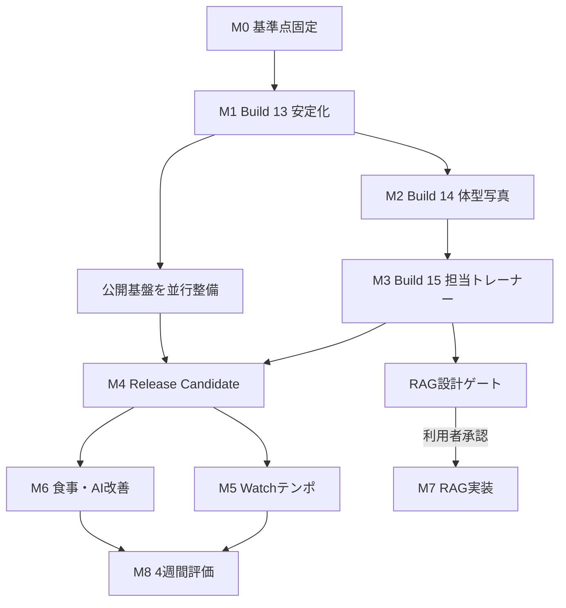

# BodyMode 実行計画

更新日: 2026-08-13  
基準: 開発ソース / TestFlight `0.1.0 (12)`  
状態: **M6コード実装済み・Simulator回帰完了・実機確認待ち**

## 1. 目的

統合マスタータスクリストのアクティブ項目を、回帰箇所を特定できる大きさで実装、検証、TestFlight配布、正式公開へ進める。

次を最優先とする。

1. 記録、Watch、AI接続の信頼性
2. 体型写真と担当トレーナーによるBodyMode固有の価値
3. App Storeへ安全に公開できる運用
4. 公開後のWatch、食事、AI精度向上

SNS、コミュニティ、課金、ギフト、ゲーミフィケーション、外部連携は無期限保留のまま実行対象から外す。固定バナー広告の本番化と安全確認だけは正式公開対象とする。

## 2. 現在地

- TestFlightの配布基準は`0.1.0 (12)`。
- 現在のブランチは`codex/build-13-stability`。作業ツリーにはBuild 12以降の広範な変更があるため、既存差分を保持したまま実装している。
- iPhone、Watch、Widget、単体テスト、iPhone UIテスト、Watch UIテストのターゲットが存在する。
- 専用の`BodyMode iPhone 17 Pro`と`BodyMode Watch Series 11`を作成・ペアリングし、別タスクのSimulatorから分離済みである。
- 回帰用に食事、AI、主要導線、設定・アクセシビリティ、Watchの5 Simulatorプールを分離し、`scripts/run_parallel_simulator_regression.sh`で3レーン並列実行できる。事前ビルドを全レーンで共有し、重いアクセシビリティ監査と利用分析テストの前には専用Simulatorを再起動する。結果は実行単位で`.build/parallel-regression/<run-id>/summary.txt`へ保存する。
- TestFlightのArchive、アップロード、外部グループ配布、フィードバック取得はスクリプト化済み。
- AIはMac mini、Ollama、Tailscale FunnelでTestFlight利用中。正式公開には認証と公開経路の変更が必要である。
- 現在のRelease広告はGoogle公式デモIDで、本番IDは未設定である。

最初に現状を基準点として固定する。未コミット変更を消去、巻き戻し、再生成しない。

## 3. 実行原則

### 3.1 変更単位

- 1ビルドにつき主目的は1つか2つに限定する。
- データモデル変更は、旧データの移行と書き出し互換を同じ変更で扱う。
- iPhoneとWatchで共有する値は、共有モデル、送信、受信、永続化、表示を1つの作業単位とする。
- AI API変更はサーバーとiPhoneの互換期間を設け、旧レスポンスでもクラッシュさせない。
- P0の再現テストを先に追加し、失敗を確認してから修正する。

### 3.2 完了の定義

各タスクは、次を満たして初めて`完了`とする。

1. 要件と例外動作がコードへ反映されている
2. 必要な移行処理がある
3. 単体テストまたは状態機械テストがある
4. 対象フローのUIテストがある
5. 診断ログに成功・失敗を残せるが、健康値や秘密情報を残さない
6. 関連仕様と機能索引が更新されている
7. Simulatorで回帰確認済み
8. センサー、触覚、HealthKit、バックグラウンド通信は実機確認済み
9. TestFlightの`What to Test`へ変更点と確認操作を記載済み

### 3.3 配布停止条件

次のいずれかがあれば、Archiveや外部配布へ進めない。

- 履歴、コンディション、記録保存、データ移行でクラッシュする
- iPhoneとWatchで別のセット、重量、単位、完了状態になる
- AI失敗時に手動入力や保存ができない
- APIキー、写真、健康値、自由記述が診断ログへ含まれる
- 最大文字サイズで主要操作が見えない、押せない、重なる
- `scripts/testflight_preflight.sh`が失敗する

正式公開では、さらに共有Bearerキー、Tailscale Funnel、AdMobデモID、未確定の法務URLが1つでも残れば提出しない。

### 3.4 Gitとロールバック

- 実行開始時に`codex/build-13-stability`ブランチを作り、保留中のゲーミフィケーションを示す現在のブランチ名から分離する。
- 基準コミット前に、102件ある未追跡パスをソース、テスト、仕様、生成物、秘密情報に分類する。
- `Config/*.local.xcconfig`、`.api_key`、App Store Connect秘密鍵、端末ログ、写真添付、Archiveをコミットしない。
- 基準コミット後は、原則として1作業パッケージを1コミットにする。
- 各TestFlight配布点へタグを付け、ビルド番号、コミット、テスト結果、サーバーAPI版を対応付ける。
- 保存モデルを変更する場合は移行前データのfixtureを保持し、移行失敗時は旧データを消さず読み取り専用で復旧できるようにする。
- サーバー変更は旧アプリを最低1ビルド期間受け入れ、問題時はサーバー側を前版へ戻しても手動記録を継続できるようにする。

## 4. 全体ロードマップ

工数はCodexが実装と自動テストを進め、利用者が必要な実機操作と外部サービス設定を行う前提の目安である。Appleの処理・審査待ちは含まない。

| 段階 | 配布単位 | 主目的 | 目安 | 公開との関係 |
|---|---|---|---:|---|
| M0 | 基準点 | 現状固定、追加統合、再現テスト | 1〜2日 | 必須 |
| M1 | Build 13 | P0安定化、Watch重量、AI三機能、食事整合 | 3〜5日 | 必須 |
| M2 | Build 14 | 体型写真を目標・比較・次の行動につなげる | 4〜6日 | 推奨 |
| M3 | Build 15 | 担当トレーナーの専門性、話し方、推薦を一貫させる | 5〜8日 | 推奨 |
| M4 | Release Candidate | 公開インフラ、広告、法務、全体受入 | 3〜5日＋利用者作業 | 必須 |
| M5 | Build 16 | Watchテンポガイド | 5〜8日 | 公開後でも可 |
| M6 | Build 17 | 食事DB、バーコード、月次・日次AI改善 | 6〜10日 | 公開後 |
| M7 | 承認後の別計画 | Evidence RAGの設計、評価、段階導入 | 2〜3週以上 | 公開後・承認制 |
| M8 | 継続評価 | 屋外有酸素、センサー精度、行動学習 | 4週間以上 | 公開後 |

M1からM3は各ビルドを外部TestFlightへ出し、最低48時間の致命的問題確認を行う。M3後に正式公開へ進むか、M5を先に入れるかを利用者が判断する。

## 5. 依存関係

## 6. M0: 現状固定と再現

### 作業

| 順 | 担当 | 内容 | 対応ID |
|---:|---|---|---|
| 1 | Codex | 現在の差分を機能別に棚卸しし、ユーザー変更を保持した基準コミットを作る | INTAKE-002、INTAKE-004 |
| 2 | Codex | `codex/build-13-stability`へ分離し、基準コミットへタグを付ける | INTAKE-003 |
| 3 | Codex | `project.yml`からXcodeプロジェクトを再生成し、生成差分を確認する | INTAKE-004 |
| 4 | Codex | 全単体テスト、主要iPhone UIテスト、Watch UIテスト、Release preflightを実行する | QA-001〜QA-004 |
| 5 | Codex | Watch重量不一致を再現するテストを追加する | WATCH-010、WATCH-015 |
| 6 | Codex | AI三機能の接続状態とエラー分類を診断ログで確認する | TFB-005、TFB-010、QA-002 |
| 7 | 利用者 | 追加要望が終了した時点で「追加完了」を明示する | INTAKE-001 |
| 8 | 共同 | 追加分を統合し、各ビルド範囲を最終確定する | INTAKE-002、INTAKE-003 |

### 成果物

- 基準コミットと変更一覧
- テスト結果ファイル
- WATCH-010の再現条件
- AIのhealth、食事、体型写真、チャットの接続結果
- Build 13の確定スコープ

### ゲート

既存テストの失敗を「以前からの失敗」と「今回の回帰」に分類できるまでM1の修正へ進まない。

## 7. M1: Build 13 安定化

### スコープ

| 作業パッケージ | 順序 | 内容 | 対応ID |
|---|---:|---|---|
| B13-1 | 1 | Watchでセット開始前後の目標重量が同じになるよう、セットIDと計画版を基準に同期する | WATCH-010 |
| B13-2 | 2 | kg/lb、0.1kg、負のアシスト重量、同種目一括変更、再送、競合を状態機械で検証する | WATCH-015 |
| B13-3 | 3 | 体型写真セットの各方向へ撮影・ライブラリ選択と権限復旧を追加する | BODY-001、TFB-011 |
| B13-4 | 4 | 食事画像の解析、補正、保存、再編集を実サーバーで回帰確認する | FOOD-001、QA-002 |
| B13-5 | 5 | 食品別内訳からPFCとカロリーを再計算し、不整合時の扱いを統一する | FOOD-002 |
| B13-6 | 6 | 体型写真とAIチャットを同じ公開エンドポイントで確認する | TFB-005、TFB-010、QA-002 |
| B13-7 | 7 | MetricKit、Watchログ、端末ログの書き出し・共有・削除を実機確認する | QA-003、QA-004、WATCH-008 |
| B13-8 | 8 | Watchの今日のメニュー選択から終了・同期までを案内するチュートリアルを追加する | WATCH-011、WATCH-015 |

### 自動テスト

- Watchの計画値保持、再同期、重複受信、古い計画版の拒否
- アシスト種目の負数と単位変換
- カメラ許可、拒否、設定からの復旧
- 食事内訳の合計、手動補正、保存後再編集
- AIの401、413、422、503、タイムアウト、壊れたJSON

### TestFlight確認

- 実機iPhoneとWatchで同じ計画を選び、最初・中間・最後のセットの重量を照合する
- チンニングまたはディップスで負のアシスト重量を確認する
- 食事、体型写真、AIチャットを4G/5GとWi-Fiで各1回成功させる
- AIを停止しても手動記録と保存が継続できることを確認する
- Watch初回チュートリアルを完了・スキップでき、設定から再表示できることを確認する

### 完了ゲート

- WATCH-010の再現テストが修正前に失敗し、修正後に成功する
- AI三機能が実機で成功し、失敗時も手動操作を失わない
- P0クラッシュがなく、preflightに合格する

## 8. M2: Build 14 体型写真

### スコープ

1. `BODY-002`: 目的、目標像、重点部位、経験を分析APIへ渡す。
2. `BODY-003`: 前回の同条件写真、同日の体重・腹囲・体脂肪率を欠測許容で要約する。
3. `BODY-004`: 結論、確認できた変化、目標への意味、良い点、次の一手、信頼度の構造化レスポンスへ移行する。
4. `BODY-005`: 写真描写より目標との関係と次の行動を先に表示する。
5. `BODY-006`: 写っていない部位、疾患、年齢、体脂肪率を断定しない回帰テストを追加する。
6. `BODY-008`: 前回の角度、距離、姿勢、照明を揃える撮影ガイドを追加する。
7. `BODY-009`: 部位別の前回差と信頼度を表示する。
8. `BODY-007`: 身体KPI参考値は精度評価の計画だけ作成し、採用基準を満たすまで数値機能を公開しない。

### 実装順

API契約と互換デコード、比較コンテキスト、安全テスト、画面表示、撮影ガイド、実機確認の順に進める。旧サーバー応答では従来コメントへフォールバックする。

### 完了ゲート

- 写真1枚から4枚まで保存、追加、削除、再分析ができる
- 前回写真やKPIがない初回利用でも成立する
- 目的に沿った説明と次の行動が先に読める
- 安全テストと`QA-008`のBODY対象が成功する
- `TFB-009`は参考数値を出さない状態でも、採否理由を文書化して閉じられる

## 9. M3: Build 15 担当トレーナー

### データと選択

| 順 | 内容 | 対応ID |
|---:|---|---|
| 1 | 人物、話し方、専門性を別モデルへ分離し、旧プロフィールを移行する | COACH-002、COACH-007 |
| 2 | 6つの専門プロファイルと7軸の指導フォーカスを定義する | COACH-008、COACH-009 |
| 3 | 目的、目標像、経験、器具、記録状況から候補と理由を作る | COACH-001、COACH-004、COACH-010 |
| 4 | 初回設定と設定画面で、推薦採用または自由選択を行う | COACH-005 |
| 5 | コーチ詳細に約束、おすすめ、重点、進め方、限界を表示する | COACH-012 |

### AIへの反映

| 順 | 内容 | 対応ID |
|---:|---|---|
| 1 | 共感、結論、記録根拠、最大3行動の共通会話原則を適用する | COACH-003、AI-003 |
| 2 | 選択した専門性と話し方をチャット、計画、食事、写真、週次へ渡す | COACH-006、COACH-011 |
| 3 | 7日、4週、長期、PR、目標、記憶、不足情報を回帰確認する | AI-001、AI-002 |
| 4 | 画面離脱後の回答とAI計画下書きを回帰確認する | AI-004、AI-005 |
| 5 | 週次レポートと目標調整候補を同じ指導原則へ合わせる | AI-006、AI-011 |

### 安全と評価

- `COACH-013`: 架空資格、医療能力、実在人物の名前・経歴・写真を生成・表示しない。
- `QA-008`: 選択保持、移行、推薦、AI文脈、全AI画面の一貫性をテストする。
- `COACH-014`: 5〜10人へ候補の分かりやすさ、相性、目標適合感を確認する。

### 完了ゲート

- 人種、性別、年齢、体型に関係なく、任意の人物と専門性を組み合わせられる
- AI関連全画面でアバター、名前、話し方が一致する
- 推薦理由と変更方法が理解できる
- 虚偽資格・医療誤認の回帰テストが成功する
- 48時間のTestFlightでP0問題がない

## 10. 並行トラック: 正式公開基盤

M1開始時からM3と並行する。ユーザー作業待ちでも、Codex側の設計、設定受け口、監視、検査は先に進める。

| 順 | 担当 | 内容 | 対応ID |
|---:|---|---|---|
| 1 | 利用者 | 運営者情報、サポートメール、返信方針を確定する | REL-001、REL-002 |
| 2 | 共同 | Privacy Policy、Terms、SupportをHTTPS公開する | REL-003 |
| 3 | 利用者 | AdMobアプリ、バナー、Privacy & messagingを作成する | REL-005 |
| 4 | Codex | 本番IDをGit管理外設定へ入れ、デモIDを本番Archiveから拒否する | REL-006 |
| 5 | 共同 | App Privacy、年齢、医療、輸出、DSA、コンテンツ権利を回答する | REL-004 |
| 6 | Codex | Xcode Privacy Reportと広告SDKの送信内容を台帳へ照合する | REL-007、S106 |
| 7 | 共同 | ユーザー単位の短命AIトークン、失効、レート制限を設計・実装する | REL-008 |
| 8 | 共同 | 独自ドメインとNamed Tunnel等の安定公開経路へ移行する | REL-009 |
| 9 | Codex | health監視、再起動、利用上限、障害ログ、復旧手順を整備する | REL-010 |

固定バナーの既存基盤と広告報告は再実装しない。広告非表示権利、追加広告、課金は無期限保留のままとする。

## 11. M4: Release Candidateと正式公開

### 自動ゲート

- 全単体テスト
- iPhone主要UIテスト
- Watch主要UIテスト
- `QA-008`のBODY/COACHテスト
- `scripts/testflight_preflight.sh`
- `REQUIRE_PRODUCTION_ADS=1 scripts/testflight_preflight.sh`
- Release Archive内のiPhone、Watch、Widget、Privacy Manifest、広告SDK確認
- APIキー、秘密鍵、開発用URL、デモ広告IDのバイナリ検査

### 実機ゲート

| 対象 | 確認 | 対応ID |
|---|---|---|
| 全体 | 初回設定から書き出し・削除まで主要フローを一周 | QA-001 |
| AI | 食事、体型写真、チャット、手動フォールバック | QA-002 |
| Watch | HealthKit保存、回数推定、オフライン再送、ライブ同期 | WATCH-001〜WATCH-004 |
| 診断 | TestFlightクラッシュ、MetricKit、共有・削除 | QA-003、QA-004 |
| 操作性 | VoiceOver、最大文字、ライト・ダーク、2テーマ | QA-005〜QA-007 |
| 広告 | 継続表示、誤タップ、同意、報告、主要操作との競合 | QA-010 |

### 提出

1. `REL-011`の共同受入へ署名する。
2. バージョンを`1.0.0`、ビルド番号を未使用番号へ更新する。
3. ArchiveとApp Store提出素材を生成する。
4. App Store Connect APIキーでアップロードする。
5. 審査メモへAI、HealthKit、Watch、手動フォールバック、広告、アカウント不要を記載する。
6. `REL-012`としてApp Reviewへ提出する。

公開後は`REL-013`で5〜10人以上の初期利用を維持し、`REL-014`のKPIを週次確認する。外部利用分析は`REL-015`の保存地域、同意、削除、費用が合意されるまで有効化しない。

## 12. M5: Build 16 Watchテンポ

### 実装順

1. `WATCH-012`: 計画セットへ任意の挙上秒数・下降秒数を追加し、旧データの未設定を許容する。
2. iPhone編集、共有モデル、Watch送受信、実績、履歴、書き出しを更新する。
3. `WATCH-013`: 1秒単位の触覚、方向切替、停止、再開、スキップ、無効化の状態機械を作る。
4. `WATCH-014`: 計画テンポ、観測可能な反復間隔、手動補正を別項目として保存する。
5. `WATCH-015`: Simulatorでテンポ状態機械と既存の重量・チュートリアルを回帰テストする。
6. `WATCH-016`: 実機で触覚とタイミングを評価する。

### 実機評価

- 押す種目、引く種目、脚種目を各3セット
- 1秒、2秒、3秒のテンポ
- 画面消灯、バックグラウンド、休憩移行、中断再開
- 60分使用時の電池消費を既存モードと比較
- 触覚が分かりにくい、集中を妨げる、テンポがずれる場合は初期オフを維持

`WATCH-005`と`WATCH-008`もこの実機試験へ統合する。適応休憩と回復分析は短期試験だけで確定せず、M8へ送る。

## 13. M6: Build 17 食事・AI改善

実装日: 2026-08-13。Evidence RAGを含めず、以下をコードと自動テストへ反映済み。バーコードカメラ、通知の煩わしさ、学習重みは実利用評価を継続する。

### 食事

- `FOOD-003`: 日本食品標準成分表をバージョン付きローカルDBへ変換し、AIは食品名と量の候補選択だけを行う。
- `FOOD-004`: バーコード、基準量、実食量、該当なしの手入力を追加する。
- `FOOD-005`: 目的と当日不足量に基づき、現実的な複数候補を提示する。

### AIとおまかせ

- `AI-007`: 月次レビューと翌月目標案を、確認後だけ保存する。
- `AI-008`: DailyActionの完了率、採用率、変更率から提案ルールを評価する。
- `AI-009`: 朝・夜通知の許可、開封、停止傾向から頻度を調整する。
- `AI-010`: 端末内の完了・スキップ傾向を使い、ユーザーが説明・リセットできる形で学習する。

### 完了ゲート

- 同じ食品と量から同じ栄養値が算出される
- DBの出典、版、更新日、欠測時の扱いを確認できる
- AI推定はユーザー確認なしに保存されない
- 行動学習は端末内で停止・リセットでき、健康値を分析イベントへ出さない

## 14. M7: Evidence RAG

RAGは**この実行計画が承認されても自動的には実装開始しない**。設計成果物を利用者が確認し、別途「RAG実装開始」を指示した場合だけR0からR3へ進む。

### R0: 設計と権利確認

- 対象領域、情報源、保存可能範囲、品質階層、確度、医療境界、プライバシー、性能予算を決める。
- 対応: `RAG-001`、`RAG-002`、`RAG-006`、`RAG-009`〜`RAG-013`、`RAG-019`、`RAG-029`〜`RAG-031`。

### R1: 文献同期と索引

- PubMed差分、Europe PMCの利用可能本文、Crossrefの訂正・撤回を取得する。
- 文献モデル、重複排除、構造化チャンク、週次更新を実装する。
- 対応: `RAG-003`〜`RAG-008`、`RAG-014`、`RAG-025`。

### R2: 検索と評価

- ハイブリッド検索、対象者適合、根拠不足フォールバックを実装する。
- 代表質問50件以上を用意し、Recall@5、根拠適合、撤回除外、対象者一致を測る。
- 対応: `RAG-015`、`RAG-016`、`RAG-018`、`RAG-026`〜`RAG-028`。

公開条件:

- 撤回文献の回答利用が0件
- 重要主張の出典対応率95%以上
- 根拠外の断定と危険な医療回答が評価セットで0件
- Recall@5が85%以上
- Mac miniでp95応答60秒以内、120秒タイムアウト内

基準を満たさない場合は検索・評価を改善し、アプリへ接続しない。

### R3: チャット限定導入

- 取得文献だけを回答根拠にし、主張と出典を対応付ける。
- 出典カード、詳細、確度、更新状態を表示する。
- 対応: `RAG-017`、`RAG-020`〜`RAG-024`、`QA-009`。

最初はAIチャットだけに限定する。週次、日次、計画への展開はチャット評価後に`RAG-019`を再判断する。

## 15. M8: 継続評価

### Apple Watch

- `WATCH-002`: 主要10種目を各3セット測定し、回数誤差と手動修正率を記録する。
- `WATCH-006`: 適応休憩の採用、変更、無視の理由を確認する。
- `WATCH-007`: 4週間のRPE、達成率、睡眠、HRV傾向で重みを調整する。
- `WATCH-009`: 屋外有酸素を筋トレと別ワークアウトとして設計し、ルート同意と位置情報保護を確認する。

### プロダクト

- DailyActionを1件以上完了した日をNorth Starとして週次確認する。
- AI提案変更率が高い場合は学習強化ではなく、提案を安定させる。
- コーチ変更率、食事補正率、Watch手動修正率を、精度とUX改善の判断材料にする。

## 16. TestFlight配布手順

各ビルドで同じ手順を使う。

1. 対象IDと`What to Test`を確定する。
2. 対象テストと全単体テストを実行する。
3. iPhoneとWatchのSimulatorでスクリーンショットを確認する。
4. 実機必須項目を確認する。
5. `scripts/testflight_preflight.sh`を実行する。
6. ビルド番号を1つ上げる。
7. Distribution Archiveを作成する。
8. `scripts/upload_testflight_archive.sh <archive>`でアップロードする。
9. 処理完了後、`scripts/distribute_testflight_build.sh <build>`で外部グループへ追加する。
10. 48時間後と7日後に`scripts/fetch_testflight_feedback.sh`でフィードバックを取得する。
11. P0は即時修正、P1は次ビルド候補、P2以降はマスターへ統合する。

## 17. テストマトリクス

長い回帰では、同一Simulatorを複数プロセスから操作しない。食事、AI、主要導線、設定・アクセシビリティ、Watchを固有UUID・固有xcresultへ割り当て、`scripts/run_parallel_simulator_regression.sh`で共有ビルド後に3レーン並列実行する。複数エージェントへ分担する場合はDerivedDataも担当ごとに分離する。別プロジェクト用Simulatorは名前や起動状態にかかわらず操作対象にしない。完了後は`.build/parallel-regression/<run-id>/summary.txt`へ合否件数を集約する。

| 変更種別 | 単体 | iPhone UI | Watch UI | 実機 | Preflight |
|---|:---:|:---:|:---:|:---:|:---:|
| iPhone表示だけ | 必要時 | 必須 | - | Dynamic Type/VoiceOver | 必須 |
| 保存モデル | 必須 | 必須 | 共有時必須 | 移行確認 | 必須 |
| Watch同期 | Reducer必須 | ライブ表示 | 必須 | 必須 | 必須 |
| HealthKit・センサー・触覚 | 必須 | 必要時 | 必須 | 必須 | 必須 |
| AI API | デコード・エラー必須 | スタブ必須 | - | 実サーバー必須 | 必須 |
| 広告・プライバシー | 設定必須 | 全主要画面 | Watch非搭載確認 | 同意確認 | 本番ID必須 |
| RAG | 検索・安全必須 | 出典UI | - | 実サーバー | QA-009必須 |

## 18. 利用者に依頼する作業

Codex側で進められない物理・契約・最終判断だけをまとめる。

- 追加要望終了の宣言と各ビルドスコープ承認
- iPhoneとApple Watchの装着を伴うワークアウト、触覚、電池評価
- 運営者情報、住所表示方法、サポートメールの確定
- 法務文書の最終確認と公開
- AdMobのアプリ、バナー、Privacy & messaging作成
- 独自ドメインの取得方針とDNS権限
- App Store Connectの事業者・プライバシー・年齢等の最終回答
- RAG実装開始と正式公開タイミングの判断

それ以外のコード、テスト、診断、Archive、アップロード、外部TestFlight追加、フィードバック取得はCodex側で進める。

## 19. 直近の着手順

追加受付が完了したら、次の順で開始する。

1. 現在の差分を基準コミットへ固定する
2. Build 13専用ブランチへ分離する
3. Xcodeプロジェクトを再生成する
4. 全単体テストを実行する
5. Watch Simulatorのペアを再接続する
6. WATCH-010の再現テストを作る
7. Watch重量不一致を修正する
8. BODY-001とWATCH-011を実装する
9. FOOD-001、QA-002の実サーバー回帰を行う
10. Build 13の全受入とpreflightを実行する
11. TestFlight Build 13を配布する

実行中は、各IDに対象ビルド、開始日、完了日、テスト証跡を追記し、完了した項目だけマスターの状態を更新する。

## 20. タスク網羅表

| マスターID | 実行段階 |
|---|---|
| `INTAKE-001`、`INTAKE-002`、`INTAKE-003`、`INTAKE-004` | M0 |
| `TFB-001`、`TFB-002`、`TFB-003`、`TFB-004`、`TFB-006`、`TFB-007`、`TFB-008` | 完了済み。M0以降の回帰対象 |
| `TFB-005`、`TFB-010`、`TFB-011` | M1 |
| `TFB-009`、`TFB-012` | M2 |
| TFB-013 | M3 |
| `BODY-001` | M1 |
| `BODY-002`、`BODY-003`、`BODY-004`、`BODY-005`、`BODY-006`、`BODY-007`、`BODY-008`、`BODY-009` | M2 |
| `COACH-001`、`COACH-002`、`COACH-003`、`COACH-004`、`COACH-005`、`COACH-006`、`COACH-007`、`COACH-008`、`COACH-009`、`COACH-010`、`COACH-011`、`COACH-012`、`COACH-013`、`COACH-014` | M3 |
| `AI-001`、`AI-002`、`AI-003`、`AI-004`、`AI-005`、`AI-006`、`AI-011` | M3 |
| `AI-007`、`AI-008`、`AI-009`、`AI-010` | M6 |
| `FOOD-001`、`FOOD-002` | M1 |
| `FOOD-003`、`FOOD-004`、`FOOD-005` | M6 |
| `WATCH-010`、`WATCH-011`、`WATCH-015`の重量・チュートリアル部分 | M1 |
| `WATCH-001`、`WATCH-002`、`WATCH-003`、`WATCH-004` | M4。`WATCH-002`は初期精度確認 |
| `WATCH-005`、`WATCH-008`、`WATCH-012`、`WATCH-013`、`WATCH-014`、`WATCH-015`のテンポ部分、`WATCH-016` | M5 |
| `WATCH-006`、`WATCH-007`、`WATCH-009` | M8 |
| `QA-001`、`QA-002`、`QA-003`、`QA-004`、`QA-005`、`QA-006`、`QA-007`、`QA-008`、`QA-010` | M1〜M4の各ゲート |
| QA-009 | M7 |
| `REL-001`、`REL-002`、`REL-003`、`REL-004`、`REL-005`、`REL-006`、`REL-007`、`REL-008`、`REL-009`、`REL-010` | M1〜M3と並行 |
| `REL-011`、`REL-012`、`REL-013`、`REL-014`、`REL-015` | M4と公開後運用 |
| `RAG-001`、`RAG-002`、`RAG-003`、`RAG-004`、`RAG-005`、`RAG-006`、`RAG-007`、`RAG-008`、`RAG-009`、`RAG-010`、`RAG-011`、`RAG-012`、`RAG-013`、`RAG-014`、`RAG-015`、`RAG-016`、`RAG-017`、`RAG-018`、`RAG-019`、`RAG-020`、`RAG-021`、`RAG-022`、`RAG-023`、`RAG-024`、`RAG-025`、`RAG-026`、`RAG-027`、`RAG-028`、`RAG-029`、`RAG-030`、`RAG-031` | M7。利用者承認まで設計のみ |
| `S103`、`S104`、`S106`の既存広告範囲 | 公開基盤とM4。広告非表示権利は対象外 |
| S67〜S123、GAME-001〜008、CLOUD-001〜004の無期限保留項目 | 実行対象外 |

完了済みのTFB-001〜004、006〜008と完了済み基盤は、各ビルドの回帰対象として維持し、再実装しない。
